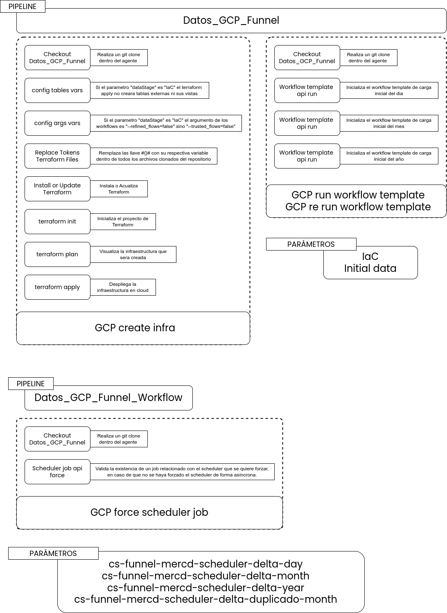

[[_TOC_]]

# Introducción

Este documento constituye la especificación del despliegue de la infraestructura y la ejecución forzada de los schedulers a demanda para el proyecto de Analítica Funnel. Se enfoca en los procesos y requisitos necesarios para implementar y mantener la infraestructura requerida, así como en la capacidad de ejecutar los schedulers de manera forzada a demanda.

# Diagrama

# Pipelines

La solución cuenta con 2 pipelines denominados 'Datos_GCP_Funnel' y 'Datos_GCP_Funnel_Workflow'. Estos pipelines permiten el levantamiento inicial de la infraestructura, la carga inicial de los datos y la ejecución forzada de workflows templates a través de sus schedulers respectivamente.

# Stages

Los pipelines consumen 3 stages fundamentales: 'Data infrastructure', 'Data initialization' y 'Workflow deployment'. Aunque no difieren en su finalidad respecto a otros proyectos, cada uno se distingue por sus trabajos específicos.

## Data infrastructure

El stage 'Data infrastructure' se encarga de crear los recursos necesarios dentro de GCP, tales como Buckets, Workflow templates, Datasets, tablas, vistas y Schedulers.

Este stage es invocado por el pipeline 'Datos_GCP_Funnel' cuando el parámetro 'dataStage' es 'IaC', y con ello se ejecutará un Job 'GCP create infra', el cual creará la infraestructura inicial del proyecto sin las tablas externas, dado que para ellas ya deben existir datos dentro de los buckets.

Importante al crear los workflows template cada uno de ellos heredará los argumentos que se encuentran en el grupo de variables del proyecto, sin embargo por defecto siempre se añadirá un argumento dinámico que en este caso donde "dataStage" es "IaC" ese argumento será "--refined_flows=false"

## Data initialization

El stage 'Data initialization' constituye la fase inicial en la gestión de datos, encargada de transferir los datos desde la capa 'raw' hasta la capa 'trusted'.

Igualmente que el stage anterior este stage será invocado por el pipeline 'Datos_GCP_Funnel' cuando el parámetro 'dataStage' sea 'Initial data', y con ello se ejecutarán 3 jobs en el siguiente orden 'GCP run workflow template' el cual ejecutará los 3 workflows de carga inicial (Día, Mes y Año) con el argumento dinámico anteriormente descrito "--refined_flows=false", el siguiente job es 'GCP create infra' este job actualizará la infraestructura creando las tablas externas y actualizando el argumento dinámico a "--trusted_flows=false" dado a que el parámetro 'dataStage' es 'Initial data' dado esto los workflows de carga inicial se actualizarán en GCP, finalmente se ejecuta el job 'GCP re run workflow template' este job volverá a ejecutar los 23 workflows de carga inicial pero en vez de con el argumento '--refined_flows=false' se ejecutarán con el argumento '--trusted_flows=false'.

## Workflow deployment

El stage 'Workflow deployment' se encarga de inicializar los workflows templates, forzar los schedulers y llevar a cabo validaciones para evitar solapamientos en las ejecuciones.

 

Este stage es invocado por el pipeline 'Datos_GCP_Funnel_Workflow' y posee el parametro 'Select a Scheduler' el cual permite seleccionar sobre los 4 scheduler que contiene la solución (Día, Mes, Año, Duplicado mes), según la selección el job forzará la ejecución del workflow template relacionado con el scheduler antes verificando de que el mismo no se esté ya ejecutando

# Importante

Los flujos están construidos para ser ejecutados en un determinado orden, primero se debe ejecutar el pipeline 'Datos_GCP_Funnel' con el parametro 'dataStage' seleccionado en 'IaC' luego se debe ejecutar ese mismo pipeline pero cambiando el parametro a 'Initial data' y finalmente el pipeline de ejecucion forzada 'Datos_GCP_Funnel_Workflow' queda habilitado para su ejecución a demanda

