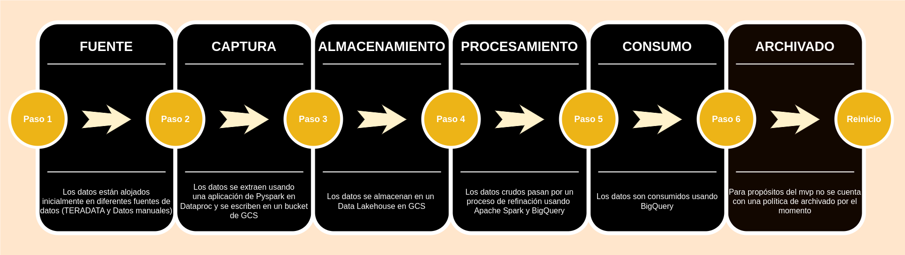
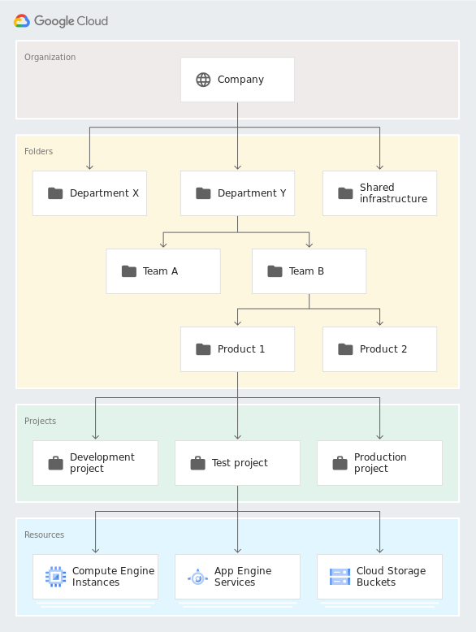
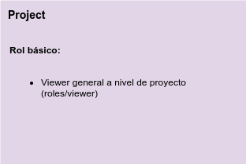
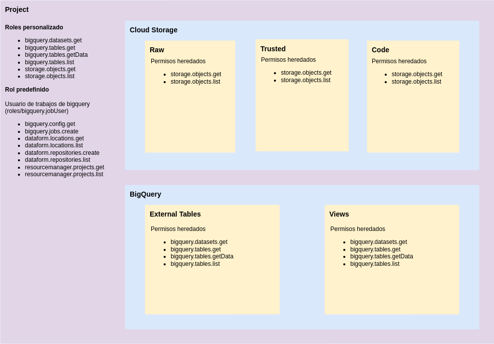
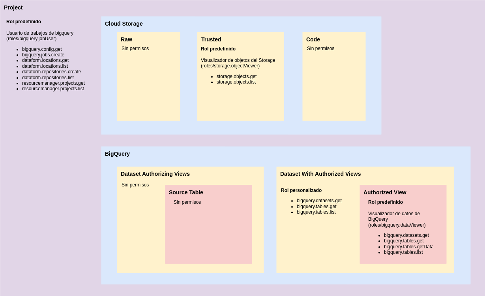

# PROYECTO FUNNEL

**Área:**

**Analista Ágil:** Sebastian Echeverri

**Dominio:** Mercadeo

**Proyecto:** FUNNEL

**Palabras Clave:** Pipeline, Google Cloud Platform (GCP), Arquitectura de datos, Modelo Dimensional, Indicadores Claves
de Desempeño (KPIs), BigQuery, PySpark, Delta Lake, Cloud Logging, IAM (Identity and Access Management)

**Infraestructura de despliegue:** Google Cloud Platform (GCP)

**Sistemas Origen:** Integraciones manuales e integraciones a través de Terraform

**Sistemas Destino:** Cloud Storage - BigQuery

**Tipo desarrollo:**

**Versión Lenguaje:** Python

#### Tabla de contenido

- [Introducción](#introducción)
- [Descripción de la necesidad](#descripción-de-la-necesidad)
    - [Contexto](#contexto)
    - [Objetivo](#objetivo)
    - [Uso de los datos](#uso-de-los-datos)
    - [Requerimientos funcionales](#requerimientos-funcionales)
    - [Alcance y resultados esperados](#alcance-y-resultados-esperados)
        - [Incluye](#incluye)
        - [No incluye](#no-incluye)
- [Arquitectura](#arquitectura)
    - [Consideraciones](#consideraciones)
        - [Técnicas](#técnicas)
    - [Características técnicas de la solución](#características-técnicas-de-la-solución)
    - [Manejo de errores](#manejo-de-errores)
    - [Manejo de reproceso](#manejo-de-reproceso)
- [Modelo Dimensional](#modelo-dimensional)
- [Gobierno de datos](#gobierno-de-datos)
    - [Tecnología](#tecnología)
        - [Almacenamiento de datos](#almacenamiento-de-datos)
        - [Procesamiento](#procesamiento)
        - [Consumo](#consumo)
        - [Monitoreo](#monitoreo)
        - [Seguridad y privacidad](#seguridad-y-privacidad)
    - [Procesos](#procesos)
        - [Arquitectura](#arquitectura-1)
        - [Linaje de datos](#linaje-de-datos)
        - [Ciclo de vida de los datos](#ciclo-de-vida-de-los-datos)
        - [Monitorización y gestión](#monitorización-y-gestión)
        - [Soporte y mantenimiento](#soporte-y-mantenimiento)
    - [Personas](#personas)
        - [Esquema jerárquico de Google Cloud Platform](#esquema-jerárquico-de-google-cloud-platform)
        - [Políticas de permisos](#políticas-de-permisos)
        - [Asignación de roles](#asignación-de-roles)
        - [**Cuentas de servicios**](#cuentas-de-servicios)

# Introducción

El Proyecto Funnel de Mercadeo
representa un salto estratégico hacia una toma de decisiones más informada y basada en datos para Grupo Éxito. Este
proyecto busca implementar una solución de almacén de datos robusta y moderna que centralice los datos críticos de
negocio y los haga accesibles para análisis en profundidad y reportes oportunos.

# Descripción de la necesidad

## Contexto

El escenario empresarial cada vez es más dinámico y competitivo, la capacidad de adaptación y la toma de decisiones
fundamentadas en datos son cruciales para el éxito.
Grupo Éxito reconoce esta realidad y busca posicionarse a la vanguardia como negocio a través del proyecto "Funnel de
Mercadeo" en el que por medio de la gestión de datos, busca mejorar la toma de decisiones estratégicas y operativas.

## Objetivo

Con un volumen de datos que abarca desde ventas en línea hasta interacciones con el cliente, el Proyecto Funnel tiene
como objetivo disponibilizar 19 indicadores clave de rendimiento (KPIs) que proporcionarán insights para mejorar la toma
de decisiones estratégicas y operativas.

## Uso de los datos

La data disponible será utilizada para disponibilizar y construir 19 indicadores clave de rendimiento (KPIs).
Estos KPIs no solo servirán para representar insights confiables de la compañía, sino que también funcionaran como
herramientas fundamentales para desarrollar estrategias de análisis y soportar la toma de decisiones efectivas.

## Requerimientos funcionales

**Arquitectura y Diseños de Flujos de Integración**

- Se requiere que la arquitectura diseñada y los flujos de integración, permitan la disposición de los datos en las
  siguientes capas: Raw, Trusted y Refined.

**Procesamiento de los Datos**

- Se requiere de la recopilación de datos provenientes de diferentes fuentes de información y que se disponibilicen
  correctamente en la capa Raw.
- Se requiere del adecuado procesamiento de datos para garantizar la calidad de la información en la capa Trusted.
- Se requiere de la construcción de un modelo dimensional que permita la disponibilidad y calidad de la información en
  la
  capa Refined.
- Se requiere que los datos sean gestionados de manera eficiente para garantizar un rendimiento óptimo y organización de
  los datos en la plataforma.
- Se requiere que los datos sean gestionados de manera segura a lo largo de su ciclo de vida.

**Consumo de datos:**

- Se requiere que los datos generados por el pipeline estén disponibles para consulta y análisis de los
  indicadores.

**Monitoreo y Seguridad de datos:**

- Se requiere de una estrategia de monitoreo, seguridad y control.
- Se requiere que la estrategia incluya la supervisión de los flujos de datos, el rendimiento de la solución, la
  privacidad de los datos y la detección proactiva de posibles problemas.

**Gobernanza de datos:**

- Se requiere la gobernanza de datos para garantizar la calidad, integridad, seguridad y utilización efectiva de los
  datos en una organización.
- Se requiere definir políticas de gestión de identidades y accesos que regulen quiénes tienen permisos para acceder,
  modificar y gestionar los datos.
- Se requiere que la estrategia incluya la implementación de políticas para la gestión de personas y procesos.
- Se requiere definir políticas de gestión de identidades y accesos con el objetivo de regular quiénes tienen permisos
  para acceder, modificar y gestionar los datos.

**Documentación y Despliegue:**

- Se requiere que la solución cuente con diagramas de proceso y linaje de datos claramente documentados de manera que
  proporcionen una visión completa de cómo los datos fluyen a través de la solución.
- Se requiere de documentación al rededor del modelo dimensional y el informe de los indicadores claves de desempeño
  para la comprensión del sistema.

## Alcance y resultados esperados

### Incluye

- Entendimiento de las integraciones y lineamientos de arquitectura de datos de Grupo Éxito.
- Diseño e implementación de los flujos de integración.
- Diseño, implementación y documentación sobre las definiciones de arquitectura de datos.
- Diseño e implementación y documentación del modelo dimensional adaptado a los requerimientos del negocio.
- Creación de stored procedures en BigQuery para el cálculo de indicadores.
- Creación de las vistas y tablas en BigQuery correspondientes al modelo dimensional (capa Refined).
- Informe de Indicadores Clave de Desempeño (KPIs).
- Diseño e implementación de estrategias de monitoreo y control de la solución.
- Diseño e implementación de políticas de gestión de identidades y accesos.
- Diseño e implementación de diagramas de proceso y linaje de datos.
- Despliegue a los ambientes que la compañía disponga (DEV y PDN).

### No incluye

- Construcción de tableros de visualización de datos.
- Construcción de procesos de ingesta de datos.

# Arquitectura

En el contexto de una transformación radical impulsada por las tecnologías en la nube, Google Cloud Platform (GCP) se
destaca como una solución líder, proporcionando servicios innovadores que ofrecen agilidad, escalabilidad y seguridad
esenciales para las empresas modernas.
Este apartado hace énfasis en la arquitectura de datos propuesta para el proyecto Funnel de Mercadeo, destacando la
necesidad de una infraestructura bien planificada capaz de respaldar tanto la operación inmediata como la visión a largo
plazo de la organización.

De manera general, se subraya la importancia de la arquitectura de datos en la gestión eficiente de la información
empresarial. Este conjunto de estructuras y procesos se encarga de capturar, procesar, almacenar, modelar, publicar y
aprovechar los datos de manera efectiva.
En el proyecto actual, se enfoca en la construcción de un Data Lakehouse en Google Cloud Platform, consolidando datos
desde diversas fuentes para su almacenamiento centralizado.

A continuación, se anexa el documento correspondiente a la arquitectura implementada para el proyecto FUNNEL.
El documento sirve como un detallado insumo fundamental que proporciona el marco, el diseño sistemático e implementación
de la arquitectura, siguiendo las mejores prácticas y recomendaciones de expertos.
El objetivo es establecer una base robusta y eficiente para el manejo de datos, potenciando la inteligencia de negocios
y la toma de decisiones informadas.

[Documentación detallada de la arquitectura](./reports/documento_arquitectura_funnel.md)

## Consideraciones técnicas

- Es importante tener en cuenta que los cambios en los flujos de datos (desarrollos técnicos) pueden tener un impacto
  significativo en el sistema. Por esta razón, se han establecido procesos rigurosos para asegurar la estabilidad y
  calidad de los datos, en lugar de considerar modificaciones a los flujos. Este enfoque cuidadoso contribuirá a una
  gestión más eficiente y efectiva de los datos a largo plazo.
- La tolerancia a fallos de la aplicación está contemplada de la siguiente manera:
    - Se cuenta con una zona de cuarentena a donde se llevan los archivos que no pasen el proceso de validación.
    - El sistema esta habilitado un punto de control que almacena el estado del procesamiento (checkpoint), si en algún
      momento falla la aplicación, el procesamiento se ejecuta desde el último punto de control correcto almacenado.
- En Spark, se aplica el esquema "on read". Esto significa que se asigna el esquema cuando se leen los datos. La
  aplicación del esquema en el momento de la lectura permite verificar automáticamente la consistencia de los datos con
  el esquema especificado y, en caso de ser necesario, realizar una conversión de tipos. En caso de que el esquema del
  archivo de datos no coincida con el esquema definido, el archivo de datos es llevado a la zona de cuarentena para
  evitar afectar la integridad y calidad del dato.
- Esta aplicación fue diseñada en Apache Spark 3.3.2 y Python 3.10. Además, se tienen las siguientes dependencias:
    - `dynaconf == 3.2.2`
    - `toml == 0.10.2`
    - `great-expectations == 0.18.7`
    - `gcsfs == 2023.5.0`
- La aplicación se diseñó usando la API de Structured Streaming de Spark, pero de tal forma que los ETLs se comporten
  como un proceso batch, esto usando un trigger de `once`. El objetivo es que, en lugar de procesar los datos en tiempo
  real, se procesen todos los datos disponibles en un solo lote. Esto se hace para aprovechar la funcionalidad
  de `checkpoint` que proporciona la API de Structured Streaming. El checkpointing es una funcionalidad clave que
  permite a Spark mantener un registro del estado actual del procesamiento de datos en un stream, incluyendo los datos
  que han sido procesados y los que aún deben ser procesados. Esto es importante porque permite a Spark recuperarse de
  fallos y continuar el procesamiento de datos desde donde lo dejó en caso de un reinicio o una interrupción.

## Características técnicas

Las hojas técnicas de infraestructura se relacionan en las siguientes tablas:

| Sistema                                     | Tipo             | Nombre del recurso                                         |
|---------------------------------------------|------------------|------------------------------------------------------------|   
| GCS (Capa Raw)                              | Almacenamiento   | co-grupo-exito-funnel-mercd-raw-data-[ambiente]            |
| Dataproc Workflow (Carga Inicial Day)       | Flujo de trabajo | dp-funnel-mercd-workflow-carga-inicial-day-[ambiente]      |
| Dataproc Workflow (Carga Inicial Month)     | Flujo de trabajo | dp-funnel-mercd-workflow-carga-inicial-month-[ambiente]    |
| Dataproc Workflow (Carga Inicial Year)      | Flujo de trabajo | dp-funnel-mercd-workflow-carga-inicial-year-[ambiente]     |
| Dataproc Workflow (Delta Day)               | Flujo de trabajo | dp-funnel-mercd-workflow-delta-day-[ambiente]              |
| Dataproc Workflow (Delta Month)             | Flujo de trabajo | dp-funnel-mercd-workflow-delta-month-[ambiente]            |
| Dataproc Workflow (Delta Year)              | Flujo de trabajo | dp-funnel-mercd-workflow-delta-year-[ambiente]             |
| Dataproc Workflow (Delta Duplicado Month)   | Flujo de trabajo | dp-funnel-mercd-workflow-delta-duplicado-month-[ambiente]  |
| Dataproc Cluster                            | Procesamiento    | dp-funnel-mercd-pipeline-[ambiente]                        |
| Dataproc Job                                | Trabajo          | dp-funnel-mercd-job-[ambiente]                             |
| GCS (Capa Trusted)                          | Almacenamiento   | co-grupo-exito-funnel-mercd-trusted-data-[ambiente]        |
| BigQuery (Dataset Modelo Dimensional)       | Base de datos    | refined_funnel_mercd_dimensional_model                     |
| BigQuery (Dataset Tablas Externas)          | Base de datos    | refined_funnel_mercd_external_tables                       |
| BigQuery (Dataset Vistas)                   | Base de datos    | refined_funnel_mercd_views                                 |
| BigQuery (Dataset Procedures)               | Base de datos    | refined_funnel_mercd_procedures                            |
| Cloud Scheduler Job (Delta Day)             | Orquestador      | cs-funnel-mercd-scheduler-delta-day-[ambiente]             |
| Cloud Scheduler Job (Delta Month)           | Orquestador      | cs-funnel-mercd-scheduler-delta-month-[ambiente]           |
| Cloud Scheduler Job (Delta Year)            | Orquestador      | cs-funnel-mercd-scheduler-delta-year-[ambiente]            |
| Cloud Scheduler Job (Delta Duplicado Month) | Orquestador      | cs-funnel-mercd-scheduler-delta-duplicado-month-[ambiente] |

Esta integración está orquestada por el Cloud Scheduler de GCP:

| Parámetros Cloud Scheduler                                 |            |          |                                                                                                                                                                                                         |            |                |                                      |
|------------------------------------------------------------|------------|----------|---------------------------------------------------------------------------------------------------------------------------------------------------------------------------------------------------------|------------|----------------|--------------------------------------|
| Nombre de la Tarea                                         | Frecuencia | Objetivo | URL                                                                                                                                                                                                     | Verbo HTTP | Tipo de cuerpo | Cuerpo                               |
| cs-funnel-mercd-scheduler-delta-day-[ambiente]             | 0 6 * * *  | HTTP     | https://dataproc.googleapis.com/v1/projects/co-grupo-exito-funnel-mercd-[ambiente]/regions/us-central1/workflowTemplates/dp-funnel-mercd-workflow-delta-day-[ambiente]:instantiate?alt=json             | POST       | JSON           | {User-Agent: Google-Cloud-Scheduler} |
| cs-funnel-mercd-scheduler-delta-month-[ambiente]           | 0 6 * * *  | HTTP     | https://dataproc.googleapis.com/v1/projects/co-grupo-exito-funnel-mercd-[ambiente]/regions/us-central1/workflowTemplates/dp-funnel-mercd-workflow-delta-month-[ambiente]:instantiate?alt=json           | POST       | JSON           | {User-Agent: Google-Cloud-Scheduler} |
| cs-funnel-mercd-scheduler-delta-year-[ambiente]            | 0 6 * * *  | HTTP     | https://dataproc.googleapis.com/v1/projects/co-grupo-exito-funnel-mercd-[ambiente]/regions/us-central1/workflowTemplates/dp-funnel-mercd-workflow-delta-year-[ambiente]:instantiate?alt=json            | POST       | JSON           | {User-Agent: Google-Cloud-Scheduler} |
| cs-funnel-mercd-scheduler-delta-duplicado-month-[ambiente] | 0 6 * * *  | HTTP     | https://dataproc.googleapis.com/v1/projects/co-grupo-exito-funnel-mercd-[ambiente]/regions/us-central1/workflowTemplates/dp-funnel-mercd-workflow-delta-duplicado-month-[ambiente]:instantiate?alt=json | POST       | JSON           | {User-Agent: Google-Cloud-Scheduler} |

## Manejo de errores

|                | Si/No | Cómo se realiza                                                          |
|----------------|-------|--------------------------------------------------------------------------|
| Notificaciones | Si    | Manejo a través de operaciones con el equipo de monitoreo de Grupo Exito |
| Reintentos     | Si    | Se ejecuta de nuevo el flujo de trabajo manualmente                      |
| Trazabilidad   | Si    | En los logs enrutados al proyecto de logging y monitoreo                 |

## Manejo de reproceso

Especificar los puntos en que se debe hacer el reproceso y cómo hacerlo.

| Punto                           | Como se reprocesa                                                     | Aplicabilidad |
|---------------------------------|-----------------------------------------------------------------------|---------------|
| Fallo en el trabajo de Dataproc | Se debe iniciar manualmente el trabajo en Dataproc desde el Pipeline. |               |

# Modelo dimensional

El Proyecto Funnel de Mercadeo emerge como una iniciativa clave para Grupo Éxito, marcando un hito en su camino hacia la
excelencia analítica y una comprensión profunda de las dinámicas de mercado.
Este esfuerzo pionero busca implementar una solución de almacén de datos de vanguardia que centralice datos críticos del
negocio, facilitando un acceso sin precedentes para análisis en profundidad y la generación de reportes oportunos.
Con el desafío de manejar un volumen de datos que abarca desde las ventas en línea hasta las interacciones con los
clientes, el Proyecto Funnel se propone hacer accesibles 19 indicadores clave de rendimiento (KPIs), que serán
esenciales para afinar las estrategias de marketing y ventas.
Para la resolución de necesidad se detalla el diseño e implementación de una solución de modelado dimensional que se
estructura alrededor de un conjunto de tablas de hechos y dimensiones, concebidas para soportar consultas analíticas y
reportes.

Para aquellos no familiarizados con los términos y procedimientos específicos de esta metodología, se incluye un
glosario de términos clave, ofreciendo una comprensión clara de conceptos esenciales. Estos fundamentos no solo
enriquecen la comprensión del lector sino que también sientan las bases para apreciar la complejidad y la meticulosidad
del diseño propuesto.
Además, cabe destacar que el desarrollo se realizó siguiendo la metodología de Kimball, líder y exponente en el diseño
de Data Warehouse, el cual se centra en la claridad lógica y la eficiencia técnica, garantizando una solución escalable
y mantenible.
Este documento profundiza en las etapas críticas del diseño dimensional, desde la selección de procesos de negocio hasta
la identificación de hechos, cada una vital para asegurar que la solución cumpla con las necesidades analíticas de la
organización.
Para aquellos interesados en profundizar más en los detalles técnicos y las especificaciones de este proyecto
transformador, se anexa el documento completo correspondiente a la arquitectura implementada para el Proyecto Funnel de
Mercadeo.

[Documentación Detallada del Modelo Dimensional](./reports/documento_modelo_dimensional_funnel.md)

# Gobierno de datos

El gobierno de datos es el conjunto de políticas, procedimientos y prácticas que se utilizan para gestionar, proteger y
utilizar los datos de una organización. Esto incluye aspectos como la recolección, almacenamiento, uso, seguridad y
privacidad de los datos, así como la toma de decisiones basadas en datos. El objetivo del gobierno de datos es asegurar
que los datos se utilicen de manera efectiva y ética, y que se cumplan las regulaciones y leyes aplicables.

En este proyecto se siguen las buenas prácticas recomendadas por **DAMA** (Data Management Association), que es una
asociación profesional que promueve la gestión de datos y el gobierno de datos. El marco de trabajo de **DAMA** se
conoce como el marco de referencia de gobierno de datos de **DAMA (DAMA-DMBOK)**. Este marco proporciona una estructura
general para la gestión de los datos de una organización, incluyendo los procesos, roles y responsabilidades, y las
mejores prácticas para la gestión de datos.

**DAMA-DMBOK** se basa en 3 pilares fundamentales: personas, procesos y tecnología.

1. **Tecnología**: Es el uso de la tecnología para apoyar la gestión de los datos. Incluye la selección, implementación,
   integración con los procesos de negocio y la gestión de la tecnología.
2. **Procesos**: Es la estructura de los procesos que se utilizan para recopilar, almacenar, gestionar y proteger los
   datos. Incluye la definición, documentación, medida de la eficacia y la mejora continua de los procesos.
3. **Personas**: Es el aspecto humano de la gestión de los datos. Incluye la identificación de los roles y
   responsabilidades, la formación y el desarrollo de habilidades, y la gestión de los cambios culturales necesarios
   para la implementación exitosa de una estrategia de gobierno de datos.

Cada uno de estos pilares son importante para el éxito de la estrategia de gobierno de datos, ya que se constituye en un
engranaje funcional para garantizar que los datos sean precisos, completos y estén disponibles para su uso.

## Tecnología

El pilar de tecnología del **DAMA-DMBOK** es un componente importante del marco de gobierno de datos que se refiere a la
selección, implementación y uso de tecnologías de información para apoyar la gestión de los datos.

Esto incluye la selección de herramientas y plataformas que ayuden a capturar, almacenar, procesar, distribuir y
analizar los datos de manera efectiva. También incluye la implementación de medidas de seguridad y privacidad para
garantizar la protección de los datos, así como la implementación de soluciones de gestión de metadatos y de calidad de
datos para garantizar la integridad y la consistencia de los datos a lo largo del tiempo.

### Almacenamiento de datos

**Cloud Storage**

Google Cloud Storage es un servicio de almacenamiento en la nube que ofrece Google. El servicio ofrece seguridad y
rendimiento de alto nivel para almacenar grandes cantidades de datos sin tener que preocuparse por la administración de
la infraestructura subyacente. Es el almacén donde se alojan todos los datos del proyecto.

### Procesamiento

**Dataproc**

Google Cloud Dataproc es un servicio de procesamiento de datos en la nube de Google que simplifica la configuración, el
aprovisionamiento y el escalado de clusters de Apache Hadoop y Apache Spark para la computación de datos. Es la
herramienta encargada de ejecutar la aplicación de Pyspark del proyecto.

**Apache Spark**

Apache Spark es un framework de procesamiento de datos distribuido que se utiliza comúnmente para construir procesos
ETL (extracción, transformación y carga) debido a su capacidad para manejar grandes volúmenes de datos de manera
eficiente.

El funcionamiento de Spark para construir ETLs se basa en su capacidad para leer datos de diferentes fuentes,
procesarlos y escribirlos en una variedad de formatos de salida.

### Consumo

**BigQuery**

BigQuery es un servicio de análisis de datos en la nube de Google Cloud que permite a los usuarios realizar consultas a
grandes volúmenes de datos en tiempo real. Es una solución escalable y altamente disponible que se integra con otros
productos de Google Cloud, como Google Storage, lo que facilita el análisis a gran escala. BigQuery es una plataforma
popular para análisis de datos, data warehousing y Business Intelligence.

En este proyecto, BigQuery actúa como una capa de consumo de datos, lo que significa que no es necesario almacenarlos de
manera nativa. Cuando un usuario realiza una consulta en BigQuery, los datos se leen directamente desde la fuente (en
este caso, Cloud Storage) y se procesan en nodos de procesamiento distribuidos en la nube de Google. Estos nodos
realizan el trabajo de consulta y envían los resultados de vuelta al usuario.

### Monitoreo

**Cloud Monitoring**

Cloud Monitoring es un servicio de Google Cloud Platform (GCP) que permite a los usuarios supervisar y analizar el
rendimiento de sus aplicaciones y recursos en GCP. Con Cloud Monitoring, los usuarios pueden recopilar datos de
métricas, registros y trazas, y utilizar estos datos para obtener una visión en tiempo real del rendimiento de sus
aplicaciones y recursos. Esta herramienta se usa para generar las alertas automatizadas 4asociadas al procesamiento de
datos.

**Cloud Logging**

Cloud Logging es un servicio de Google Cloud Platform (GCP) que permite a los usuarios recolectar, buscar, analizar y
alertar sobre el uso de sus aplicaciones y sistemas en GCP. Es una herramienta clave para el monitoreo y la solución de
problemas en GCP.

Con Cloud Logging, los usuarios pueden recolectar registros de diferentes fuentes, como aplicaciones, contenedores,
instancias de máquinas virtuales y dispositivos, y almacenarlos en un único lugar. Los registros pueden ser buscados y
filtrados utilizando un lenguaje de consulta avanzado.

Es la herramienta que recibe los registros provenientes de los trabajos ejecutados en Dataproc.

### Seguridad y privacidad

**IAM**

Cloud IAM es un sistema de identidad y acceso de Google Cloud Platform (GCP) que controla quién tiene acceso a los
recursos de la nube y qué acciones pueden realizar con ellos. Con Cloud IAM, los usuarios y las aplicaciones pueden
obtener acceso a los recursos de GCP de manera segura y controlada.

## Procesos

### Capa de Presentación: Modelo Dimensional

La capa de presentación es fundamental dentro de una estrategia de gobierno de datos, ya que facilita el acceso y
comprensión de la información por parte de los usuarios finales, promoviendo así una cultura data-driven dentro de la
organización. Esta capa se beneficia directamente de un diseño de datos efectivo, como lo es el modelo dimensional, que
organiza los datos de manera que se optimiza para la consulta y el análisis.

#### Modelo Dimensional: Fundamento para el Gobierno de Datos

El modelo dimensional es una técnica de diseño de bases de datos orientada a facilitar el acceso a los datos de forma
rápida y comprensible, especialmente en entornos de data warehousing y business intelligence. Este modelo organiza los
datos en fact tables y dimension tables, lo cual simplifica la realización de consultas analíticas y el procesamiento de
grandes volúmenes de datos.

#### Integración con el Gobierno de Datos

La implementación de un modelo dimensional dentro de la estrategia de gobierno de datos cumple con varios objetivos
clave:

- **Facilitación de la Accesibilidad y Comprensión de Datos:** Permite a los usuarios, independientemente de su nivel
  técnico, navegar e interpretar los datos de manera intuitiva.
- **Optimización de la Consulta y Análisis:** Mejora el rendimiento de las consultas y soporta análisis complejos,
  contribuyendo a la eficiencia general de los procesos de toma de decisiones basados en datos.
- **Colaboración y Gestión Integrada de Datos:** Fomenta una colaboración efectiva entre los diferentes roles de la
  organización, desde estrategas de datos hasta desarrolladores y stakeholders del negocio, creando un entorno más
  integrado para la gestión de datos.

#### Procesos Asociados al Modelo Dimensional

Para alinear el diseño del modelo dimensional con las prácticas de gobierno de datos, se deben considerar los siguientes
procesos:

- **Establecimiento de Políticas y Estándares:** Definir políticas claras y estándares para el diseño y uso del modelo
  dimensional que aseguren la calidad y consistencia de los datos.
- **Gestión de la Calidad de Datos:** Implementar mecanismos para monitorear y mantener la alta calidad de los datos
  dentro del modelo dimensional, garantizando su precisión, integridad y fiabilidad.
- **Definición de Roles y Responsabilidades:** Especificar claramente los roles y responsabilidades en el manejo,
  análisis y reporte de datos dentro del modelo dimensional, promoviendo una gestión efectiva y eficiente de los datos.
- **Monitoreo y Mejora Continua:** Establecer procesos para el seguimiento continuo del rendimiento y la utilidad del
  modelo dimensional, así como para la identificación y ejecución de oportunidades de mejora.

La implementación de un modelo dimensional bien gestionado es un pilar clave en la estrategia de gobierno de datos, ya
que no solo mejora la eficiencia operativa, sino que también asegura la conformidad y sostenibilidad a largo plazo de
las iniciativas de datos. Este enfoque no solo facilita la respuesta a preguntas críticas sobre la gestión de datos,
sino que también maximiza el valor obtenido de ellos, optimiza costos, reduce la complejidad y garantiza la
escalabilidad y disponibilidad de las soluciones de datos.

### Arquitectura

En el [apartado 3 del documento](#arquitectura) relacionado con la arquitectura de integración y datos, se detallan las
definiciones e interacciones entre las diferentes herramientas utilizadas en el proyecto.

### Linaje de datos

Linaje de datos es el proceso de rastrear la historia de los datos desde su origen hasta su uso actual o futuro. Es una
forma de rastrear y documentar la evolución de los datos en un sistema, incluyendo cambios, transformaciones y usos. El
linaje de datos proporciona información valiosa sobre la calidad de los datos, su precisión y su confiabilidad.

El linaje de los datos se divide en dos categorías: linaje lógico y linaje físico. El linaje lógico se refiere al camino
que sigue el dato a través de los procesos y sistemas de negocio, mientras que el linaje físico se refiere al camino que
sigue el dato a través de los sistemas de almacenamiento y bases de datos.

**Nota**: El linaje se relaciona en las siguientes páginas:

- [Linaje de Datos Correspondiente a la Capa Trusted](lineage/linaje_trusted.md)
- [Linaje de Datos Correspondiente a la Capa Refined](lineage/linaje_refined.md)

### Ciclo de vida de los datos

Aunque para el presente proyecto no se aplica una política sobre el ciclo de vida de los datos, este último término se
refiere a las diferentes etapas que atraviesan los datos desde su creación hasta su eliminación o archivo.

1. **Fuente de datos**: Es la primera etapa en la que se generan o recolectan los datos.
2. **Captura**: Es la etapa en la que los datos se registran, se verifica la precisión de los datos, se validan y se
   limpian.
3. **Almacenamiento**: Es la etapa en la que los datos se guardan en un lugar seguro, accesible y confiable.
4. **Procesamiento**: Es la etapa en la que los datos se analizan, se transforman y se utilizan para generar informes y
   tomar decisiones.
5. **Uso**: Es la etapa en la que los datos se utilizan para generar informes, tomar decisiones y apoyar las operaciones
   de negocio.



### Monitorización y gestión

La monitorización y gestión de la solución en la nube, a cargo de **ARUS** con capacitación previa por parte del equipo
de Quind, se realiza desde un proyecto de GCP dedicado. Los registros enviados cumplen con filtros específicos para
facilitar la identificación y manejo eficiente de errores encontrados durante las validaciones:

```graphql
resource.type="cloud_dataproc_job"
```

Los registros de la solución están diseñados para tener una estructura y severidad definida, lo que facilita su
localización y proporciona el contexto suficiente en caso de errores conocidos. El filtro para encontrar estos logs es
el siguiente:

```graphql
jsonPayload.class="DataLibraryLogger" 
severity=ERROR 
resource.type="cloud_dataproc_job"
```

#### Validaciones Estructurales vs. Validaciones de Calidad de Datos

- **Validaciones Estructurales:** Verifican que los archivos cumplan con aspectos básicos como el formato correcto (
  CSV/Parquet), la integridad del archivo, y la conformidad con el esquema esperado.
- **Validaciones de Calidad de Datos:** Se enfocan en asegurar la precisión, la integridad y la relevancia de los datos
  dentro de los archivos, aplicando reglas más específicas sobre los datos mismos, como la verificación de valores
  nulos, la unicidad de los datos, y la consistencia de formatos.

#### Mensajes de Error de Validación

Los mensajes de error generados durante las validaciones estructurales y de calidad de datos se clasifican en las
siguientes categorías:

- `"They are not CSV/Parquet files"`: El archivo no es un archivo CSV o Parquet.
- `"Error while reading file"`: El archivo está corrupto y no es legible.
- `"Schema does not match"`: El esquema del archivo no coincide con el esquema definido.
- `"This files does not meet the expectations"`: El archivo no cumple con las validaciones de calidad de datos
  predefinidas.

#### Gestion de Errores en la Validación Estructural

La gestión eficaz de errores es un componente esencial en el proceso de monitorización de la calidad de los datos.
Cuando un archivo no pasa las validaciones, se genera un mensaje de error detallado para su posterior análisis y
corrección.

##### Mensajes de Error de Validación

Los mensajes de error generados durante la validación de archivos se clasifican en las siguientes categorías:

- `"They are not CSV/Parquet files"`: El archivo no es un archivo CSV o Parquet.
- `"Error while reading file"`: El archivo está corrupto y no es legible.
- `"Schema does not match"`: El esquema del archivo no coincide con el esquema definido.

##### Estructura de los Mensajes de Error

La estructura de los mensajes de error enviados a los registros es la siguiente:

```json
[
  {
    "message": "This is the error message",
    "files": [
      "These are",
      "the files",
      "with the same error"
    ]
  },
  {
    "message": "This is another error message",
    "files": [
      "These are",
      "other files",
      "with the same error"
    ]
  }
]
```

- Ejemplo de mensaje de error por formato incorrecto:
  ```json
  {
    "message": "File format error",
    "files": ["path/to/incorrect_format_file.txt"],
    "error": "They are not CSV/Parquet files"
  }
  ```

- Ejemplo de mensaje de error por archivo corrupto:
  ```json
  {
    "message": "File read error",
    "files": ["path/to/corrupt_file.csv"],
    "error": "Error while reading file"
  }
  ```

##### Acciones Correctivas

Cuando se detecta un error durante la validación de archivos, se deben tomar las siguientes acciones correctivas en
función del tipo de error:

- **Archivo no es CSV/Parquet:** Verificar el proceso de generación de archivos para asegurar el formato correcto. Si el
  archivo es generado manualmente, revisar las instrucciones de exportación aplicadas.

- **Archivo corrupto y no legible:** Reemplazar el archivo corrupto con una versión válida. Si el problema persiste,
  revisar el proceso de transferencia de archivos para identificar posibles causas de corrupción.

- **Esquema del archivo no coincide:** Alinear el esquema de los archivos con el esperado en el sistema. Esto puede
  implicar ajustar el proceso de generación de datos o actualizar el esquema esperado en la solución en función de
  nuevos requisitos.

#### Gestión de Errores en la Validación de Calidad de Datos

La gestión eficaz de errores es un componente esencial en el proceso de monitorización de la calidad de los datos.
Cuando un archivo no cumple con las expectativas de calidad definidas, se genera un mensaje de error detallado para
facilitar la identificación y corrección del problema.

##### Estructura de los Mensajes de Error

Cada mensaje de error generado durante la validación de calidad de datos sigue una estructura específica, diseñada para
proporcionar una visión clara del error encontrado:

```json
{
  "message": "This files does not meet the expectations",
  "files": [
    {
      "file_name": {
        "expectation_name": "Nombre de la expectativa no cumplida",
        "expectation_type": "Tipo de expectativa",
        "description": "Descripción detallada del error",
        "column": "Columna afectada",
        "success": false
      }
    }
  ]
}
```

- Ejemplo de mensaje de error por valores nulos:
  ```json
  {
    "message": "This files does not meet the expectations",
    "files": [
      {
        "path/to/null_values_file.csv": {
          "expectation_name": "NotNullExpectation",
          "expectation_type": "expect_column_values_to_not_be_null",
          "description": "Expect the column values to not be null",
          "column": "Columna afectada",
          "success": false
        }
      }
    ]
  }
  ```

##### Expectativas de Validación

Las expectativas de validación aplicadas a los datos y cómo se reflejan en los mensajes de error son las siguientes:

1. **NotNullExpectation**: Verifica que no haya valores nulos en campos críticos.
    - Aplicada a: "Fecha", "Actualizacion", "Cadena", "CadenaId", "Indicador", "IndicadorId", "Valor".

2. **DistinctValuesExpectation**: Asegura que los valores pertenezcan a un conjunto específico.
    - Aplicada a: `cadena_id`, `indicador_id`, `actualizacion`.

3. **UniqueExpectation**: Garantiza la unicidad de los valores en determinados campos.
    - Aplicada a: "CadenaId", "IndicadorId", "Fecha".

4. **RegexExpectation**: Comprueba que los valores coincidan con un patrón regex específico.
    - Patrón: '\d{4}-\d{2}-\d{2}'.
    - Aplicada a: "Fecha".

##### Acciones Correctivas

Cuando se encuentra un error, los mensajes detallados facilitan la identificación rápida del problema y la columna
afectada, permitiendo tomar acciones correctivas específicas:

- **Valores nulos en campos críticos:** Identificar y corregir las fuentes de datos para eliminar o completar los
  valores nulos antes de la carga de datos.

- **Valores duplicados en campos que deben ser únicos:** Revisar los procesos de inserción o actualización de datos para
  evitar duplicidades.

- **Valores fuera de rango o formato:** Corregir los valores de datos que no cumplen con las expectativas definidas, ya
  sea modificando los datos en la fuente o ajustando el proceso de validación de datos si los criterios han cambiado.

#### Manejo de Archivos Inválidos

Los archivos que no pasan las validaciones son movidos a una ubicación de error especificada para su revisión y
corrección. Este proceso asegura que solo los datos válidos y conformes sean procesados y almacenados para su uso
posterior.

Es importante notar que la gestión de errores es un proceso continuo. A medida que se procesan más archivos y se
implementan nuevas validaciones, es probable que se encuentren nuevos errores. Por lo tanto, es importante mantener un
proceso de gestión de errores efectivo y eficiente.

#### Caracterización de Eventos

Esta tabla proporciona una caracterización detallada de eventos críticos en el marco del monitoreo de la solución,
estableciendo claros los umbrales de advertencia y críticos, las frecuencias de chequeo, causas potenciales de cada
evento, y proporcionando un marco de acción y escalamiento para asegurar una respuesta efectiva a cualquier evento que
pueda afectar la integridad de los datos y el rendimiento del sistema.

| Evento                              | Descripción                                                                   | Severidad | Frecuencia de Chequeo | Causa Potencial                                           | Acción Inmediata                                                                                                                                                                                      | Escalamiento                    |
|-------------------------------------|-------------------------------------------------------------------------------|-----------|-----------------------|-----------------------------------------------------------|-------------------------------------------------------------------------------------------------------------------------------------------------------------------------------------------------------|---------------------------------|
| Archivos no son CSV/Parquet         | Los archivos cargados no cumplen con el formato esperado.                     | Crítico   | Al intentar procesar  | Formato incorrecto de los archivos cargados.              | 1. Verificar el formato del archivo fallido.<br>2. Corregir o convertir el archivo a un formato soportado.<br>3. Reintentar la carga.                                                                 | Notificar al equipo técnico.    |
| Error al leer archivo               | El sistema no puede leer uno o más archivos debido a corrupción o errores.    | Crítico   | Al intentar procesar  | Archivos corruptos o con errores de formato.              | 1. Identificar el archivo afectado en los logs.<br>2. Chequear la integridad del archivo y corregir o reemplazarlo.<br>3. Volver a cargar el archivo corregido.                                       | Notificar al equipo técnico.    |
| Inconsistencia en el esquema        | El esquema del archivo no coincide con el esquema esperado.                   | Alto      | Al intentar procesar  | Cambios en el esquema de datos sin actualizar el sistema. | 1. Comparar el esquema del archivo con el esquema esperado.<br>2. Ajustar el esquema del archivo o actualizar el sistema para aceptar el nuevo esquema.<br>3. Probar la carga del archivo nuevamente. | Notificar al equipo técnico.    |
| Valores nulos en campos críticos    | Se detectan valores nulos en campos donde se esperan datos.                   | Medio     | Al intentar procesar  | Errores en la fuente de datos o en el proceso de carga.   | 1. Revisar el origen de datos para identificar la causa de los valores nulos.<br>2. Corregir los datos en la fuente o aplicar un proceso de limpieza.<br>3. Cargar los datos corregidos.              | Notificar al analista de datos. |
| Valores duplicados en campos únicos | Se encuentran valores duplicados en campos que deben ser únicos.              | Medio     | Al intentar procesar  | Inserciones de datos incorrectas o duplicidad de datos.   | 1. Utilizar herramientas de deduplicación para identificar y eliminar duplicados.<br>2. Validar la unicidad de los datos antes de la carga.<br>3. Revisar las políticas de inserción de datos.        | Notificar al analista de datos. |
| Valores fuera de rango o formato    | Valores en campos específicos no cumplen con los rangos o formatos definidos. | Bajo      | Al intentar procesar  | Errores de formato o entrada de datos incorrecta.         | 1. Revisar los datos para encontrar los valores problemáticos.<br>2. Corregir los valores según las expectativas de formato o rango.<br>3. Revalidar y cargar los datos ajustados.                    | Notificar al analista de datos. |

Estas acciones y escalamientos están diseñados para garantizar que los problemas identificados sean abordados de manera
efectiva y eficiente, minimizando el impacto en la operación general de la solución y manteniendo la calidad y la
integridad de los datos procesados.

### Soporte y mantenimiento

El soporte y mantenimiento de la solución también está a cargo de los administradores de la solución, **ARUS**.

En GCP, el soporte y el mantenimiento son responsabilidad de Google. Esto significa que Google se encarga de la
disponibilidad, escalabilidad y seguridad de la plataforma y los servicios, lo que permite a los clientes centrarse en
el desarrollo y la implementación de sus aplicaciones y servicios.

GCP ofrece diferentes niveles de soporte para adaptarse a las necesidades de los clientes, desde el soporte gratuito
hasta el soporte premium con respuesta 24/7. Además, Google realiza actualizaciones y mejoras de forma regular para
mantener la plataforma y los servicios al día y optimizados para un rendimiento óptimo.

Sin embargo, los clientes son responsables de la administración y el mantenimiento de sus aplicaciones y servicios en
GCP, incluyendo la configuración y el monitoreo de la seguridad. Para facilitar el mantenimiento, GCP ofrece
herramientas y soluciones de gestión de aplicaciones, incluyendo la monitorización y el registro de eventos.

## Personas

La gestión de personas en Google Cloud Platform (GCP) se lleva a cabo usando el recurso Cloud IAM (Cloud Identity and
Access Management). Cloud IAM es un servicio de seguridad de GCP que permite a los administradores controlar quién tiene
acceso a qué recursos y qué acciones pueden realizar en ellos, mediante la asignación de roles, el control de acceso
basado en contexto, la integración con otras herramientas de seguridad y la auditoría y registro de acceso.

Los roles en GCP se utilizan para otorgar permisos específicos a los usuarios y grupos para acceder y administrar
recursos en un proyecto o en una organización. Los roles incluyen tareas como verificar la facturación, crear instancias
de máquina virtual, administrar bases de datos, etc.

Los permisos en GCP se utilizan para controlar el acceso a los recursos individuales, como una instancia de máquina
virtual o una base de datos. Los permisos se asignan a través de los roles y se pueden otorgar a usuarios y grupos
específicos.

Se sigue una política de “`Who can do what on which resource”.`

- **Who:** un principal al cual se le van a asignar ciertos roles.
- **Can do what:** las acciones que se quiere que el principal tenga la capacidad de hacer.
- **On which resource**: con la acción definida se pueden constatar la serie de roles y permisos necesarios y a que
  nivel de la jerarquía se asignan estos.

### Esquema jerárquico de Google Cloud Platform

Los recursos de Google Cloud están organizados jerárquicamente. Todos los recursos, excepto el recurso más alto de una
jerarquía, tienen exactamente un elemento superior. En el nivel más bajo, los recursos de servicio son los componentes
fundamentales que conforman todos los servicios de Google Cloud.



IAM te permite establecer políticas de permisos en los siguientes niveles de la jerarquía de recursos:

- **Nivel de organización:** El recurso de organización representa a tu empresa. Todos los recursos en la organización
  heredan las funciones de IAM otorgadas en este nivel. A fin de obtener más información,
  consulta[Control de acceso para organizaciones mediante IAM](https://cloud.google.com/resource-manager/docs/access-control-org?hl=es-419).
- **Nivel de carpeta:** Las carpetas pueden contener proyectos, otras carpetas o una combinación de ambos. Los proyectos
  heredarán las funciones otorgadas en el nivel de carpeta más alto, así como lo harán otras carpetas que se encuentren
  en esa carpeta superior. A fin de obtener más información,
  consulta[Control de acceso para carpetas mediante IAM](https://cloud.google.com/resource-manager/docs/access-control-folders?hl=es-419).
- **Nivel de proyecto:** Los proyectos representan un límite de confianza dentro de tu empresa. Los servicios dentro del
  mismo proyecto tienen un nivel de confianza predeterminado. Por ejemplo, las instancias de App Engine pueden acceder a
  los depósitos de Cloud Storage dentro del mismo proyecto. Los recursos dentro del proyecto heredan las funciones de
  IAM otorgadas en el nivel de proyecto. A fin de obtener más información,
  consulta[Control de acceso para proyectos mediante IAM](https://cloud.google.com/resource-manager/docs/access-control-proj?hl=es-419).
- **Nivel de recursos:** Además de los sistemas existentes de Cloud Storage y LCA de BigQuery, los recursos adicionales,
  como los conjuntos de datos de Genomics, los temas de Pub/Sub y las instancias de Compute Engine, admiten funciones de
  nivel inferior para que puedas otorgar permisos a ciertos usuarios a un solo recurso dentro de un proyecto.

### Políticas de permisos

En Identity and Access Management (IAM), el acceso se otorga a través de políticas de permisos, también conocidas como
políticas de IAM. Una política de permisos se adjunta a un recurso de Google Cloud. Cada política de permisos contiene
una colección de*vinculaciones de roles*que asocian una o más principales, como usuarios o cuentas de servicio, a un rol
de IAM. Estas vinculaciones de roles otorgan los roles especificados a las principales, tanto en el recurso al que se
adjunta la política de permisos como en todos
los[elementos subordinados](https://cloud.google.com/resource-manager/docs/cloud-platform-resource-hierarchy?hl=es-419)
de ese recurso. Para obtener más información sobre las políticas de permisos,
consulta[Comprende las políticas de permisos](https://cloud.google.com/iam/docs/policies?hl=es-419).

### Asignación de roles

Asignar roles a nivel de grupo en lugar de a nivel de miembro en Cloud IAM es considerada una buena práctica por varias
razones:

- **Eficiencia:** Permite a los administradores gestionar el acceso de varios miembros a la vez, en lugar de hacerlo de
  forma individual. Esto puede ahorrar tiempo y esfuerzo a medida que se añaden o quitan miembros de la organización.
- **Flexibilidad:** Permite a los administradores cambiar el acceso de un miembro a varios recursos a la vez, en lugar
  de tener que hacerlo de forma individual. Esto puede ser útil cuando un miembro cambia de cargo o deja la
  organización.
- **Seguridad:** Permite a los administradores establecer políticas de seguridad a nivel de grupo, lo que puede ayudar a
  prevenir errores y violaciones de seguridad.
- **Transparencia:** Permite a los administradores ver qué roles y permisos tienen los miembros de un grupo, lo que
  puede ayudar a identificar problemas de seguridad.

De acuerdo a estas definiciones, se identificaron 3 políticas de permisos en el ambiente de producción:

- Ingeniero de Datos
- Científico de Datos
- Analista de Datos

**Ingeniero de Datos**



Política ingeniero de datos

| Rol                   | ID                         | Principal                                 | Nivel en Jerarquía |
|-----------------------|----------------------------|-------------------------------------------|--------------------|
| Viewer                | roles/viewer               | ingenierodedatosgcpfunnel@grupo-exito.com | Proyecto           |
| Storage Object Viewer | roles/storage.objectViewer | ingenierodedatosgcpfunnel@grupo-exito.com | Proyecto           |
| BigQuery Data Viewer  | roles/bigquery.dataViewer  | ingenierodedatosgcpfunnel@grupo-exito.com | Proyecto           |

Esta política de permisos está diseñada para que el usuario tenga la posibilidad de visualizar todos los recursos
asociados a un proyecto, sin poder modificar o crear nuevos recursos.

Esta política está asignada al grupo `ingenierodedatosgcpfunnel@grupo-exito.com`.

**Científico de Datos**



Política científico

| Title                      | Principal                                  | Nivel en Jerarquía | 
|----------------------------|--------------------------------------------|--------------------|
| Data Scientist Custom Role | cientificodedatosgcpfunnel@grupo-exito.com | Proyecto           |

En el diagrama anterior podemos ver esquematizada la política de de permisos a nivel de proyecto. Se organizan los
permisos de manera jerárquica y se agrupan en roles personalizados y predefinidos siguiendo la política de privilegios
mínimos. Los permisos asignados en una mayor jerarquía se heredan en los niveles de menor jerarquía. Por ejemplo, el
permiso `bigquery.tables.get` otorgados a nivel de proyecto, se heredan a nivel de dataset.

Esta política de permisos permite que un usuario tenga las siguientes funciones y limitaciones:

- Consultar todas las vistas y las tablas externas de todos los dataset asociados al proyecto de **almacenamiento**
  desde un proyecto de **consulta** sin poder crear nuevas entidades ni modificar las existentes en BigQuery.
- Hacer trabajos de consultas en BigQuery desde un proyecto de **consulta**, sin poder guardar los resultados como
  vistas.
- Guardar y visualizar consultas SQL desde un proyecto de **consulta**.

**Asignación de política**

Esta política está asignada al grupo con email `cientificodedatosgcpfunnel@grupo-exito.com`, por lo que para otorgar o
denegar permisos a un usuario solo se debe agregar o eliminar el usuario del grupo en cuestión.

**Analista de Datos**



Política analista de datos

| Title                   | Principal                                | Nivel en Jerarquía |
|-------------------------|------------------------------------------|--------------------|
| Data Analyst Custom Rol | analistadedatosgcpfunnel@grupo-exito.com | dataset vistas     | 
| Storage Object Viewer   | analistadedatosgcpfunnel@grupo-exito.com | bucket trusted     | 

Se usan vistas autorizadas para dar acceso granular (columnar) a vistas específicas. Una vista autorizada te permite
compartir resultados de consultas con usuarios y grupos específicos sin darles acceso a los datos de origen.

Básicamente el administrador crea una vista de una tabla específica donde solo consulte las columnas y la información
que el usuario tenga permitido desde negocio ver. Posteriormente, en la tabla de origen (Cloud Storage), esta nueva
vista es autorizada a consultar la data necesaria y luego, en la nueva vista, se asignan los permisos necesarios al
usuario para que pueda visualizarla y consultarla (esto se ve plasmado en el esquema de la política de permisos).

Puede encontrar más información de este proceso en la
página [Crear una vista autorizada](https://cloud.google.com/bigquery/docs/share-access-views?hl=es-419).

El usuario al que se le aplique esta política de permisos podrá realizar las siguientes acciones:

- Visualizar y consultar las vistas granulares en las cuales tenga los permisos necesarios desde un proyecto de *
  *consulta**.

**Asignación de política**

Para asignar a un usuario esta política de permisos se deben seguir los siguientes pasos:

1. Agregar al usuario al grupo con email `analistadedatosgcpfunnel@grupo-exito.com`. Este grupo tiene el
   rol `storage.objectViewer` asignado en el bucket `co-grupo-exito-funnel-mercd-pdn` de Cloud Storage.
2. Se debe crear un nuevo dataset en BigQuery, este dataset es el que se compartirá con los usuarios. En este dataset se
   debe asignar el rol `Data Analyst Custom Rol` al grupo con email `analistadedatosgcpfunnel@grupo-exito.com`.
3. En el dataset que será compartido se crea la vista requerida `<nombre_vista>`. A esta vista se le debe asignar el
   rol `bigquery.dataViewer` al **USUARIO INDIVIDUAL** que requiere el acceso. Se debe hacer de esta forma para evitar
   que otros usuarios pertenecientes al grupo tengan acceso a vistas no permitidas o requeridas, dado que si se asigna
   este rol al grupo entero, todos los miembros tendrían acceso a la totalidad de las vistas del dataset compartido.
4. Se debe autorizar la vista. Para esto vamos al dataset fuente, de donde creamos la vista, por
   ejemplo, `refined_funnel_merc_external_tables`. En el dataset fuente seguimos los siguientes pasos:

    1. En el panel**Explorador**, selecciona el conjunto de datos.
    2. Expande la opción**Acciones**y haz clic en**Abrir**.
    3. Haz clic en**Compartir**y, luego, selecciona**Autorizar vistas**.
    4. En el panel**Vistas autorizadas**que se abre, ingresa la vista`<nombre_vista>`en el campo**Vista autorizada**.
    5. Haz clic en**Agregar autorización**.

5. Si se requieren más detalles sobre la autorización de vistas, se debe visitar la
   página [Crear una vista autorizada](https://cloud.google.com/bigquery/docs/share-access-views?hl=es-419).

> 📘 NOTA Con esta política de permisos se garantiza que las identidades que utilizan la solución como analistas de
> datos, no pueden acceder a los objetos almacenados en Cloud Storage desde la consola de Google. Pero se debe hacer
> cierta salvedad: estos SÍ podrían acceder a los objetos desde la Cloud Shell de Google, si esta no está desactivada
> para los usuarios, lo que implica un riesgo en cuanto a la filtración de datos sensibles. Este es un requisito
> importante, no solo para lo mencionado, si no también para implementar soluciones en la nube con mejores prácticas de
> seguridad. Si aún no está deshabilitado el acceso a la Cloud Shell de Google, se debe seguir la siguiente
> documentación oficial para hacerlo: Inhabilita o restablece Cloud Shell.
>
> 📘 NOTA GENERAL La recomendación por parte de Google es trabajar con ROLES PREDEFINIDOS, ya que estos son administrados
> por el propio Google, por lo que van a funcionar ante cualquier eventualidad. Los ROLES PERSONALIZADOS se deben usar
> si los PREDEFINIDOS no cumplen con los requerimientos de permisos. Hay que tener en cuenta que la administración de
> estos roles queda a cargo de los administradores de la solución.
>
> Se tienen los siguientes roles en la política de permisos asociada a un **Científico de Datos**:
>
> - **Personalizado:** `Data Scientist Custom Role` a nivel de proyecto que contiene solo los permisos definidos en la
    política.
>
> Y para la política de **Analista de Datos**:
>
> - **Predefinido:** visualizador de datos de BigQuery (`roles/bigquery.dataViewer`) a nivel de tabla.
> - **Predefinido:** visualizador de objetos de Storage (`roles/storage.objectViewer`) a nivel de bucket.
> - **Personalizado:** `Data Analyst Custom Rol` rol a nivel de dataset que contiene solo los permisos definidos en la
    política para el dataset autorizado.

### Cuentas de servicios

Una cuenta de servicio es una identidad de Google que se utiliza para acceder a los recursos y servicios de Google Cloud
Platform (GCP) de forma programática, sin necesidad de interactuar directamente con la consola de GCP. Este enfoque
programático permite a las aplicaciones y servicios que se ejecutan en GCP, como contenedores, instancias de Compute
Engine y App Engine, acceder a otros servicios de GCP, como BigQuery o Cloud Storage.
Es importante destacar que, al igual que con cualquier otra cuenta, las cuentas de servicio deben seguir las políticas
de seguridad de GCP, incluida la política de privilegios mínimos, y deben asignarse roles que limiten sus permisos para
controlar su interacción con otros recursos.

#### Cuentas de servicio administradas por el usuario

Las cuentas de servicio administradas por el usuario son identidades específicas creadas y gestionadas por los usuarios
para acceder y controlar recursos en la plataforma de Google Cloud. Estas cuentas están diseñadas para permitir a los
usuarios asignar roles y permisos personalizados, brindando flexibilidad en la administración de accesos y
autorizaciones a servicios y recursos en la nube de Google.
La asignación de roles se realiza en el proyecto en la sección IAM & Admin, agregando la cuenta de servicio con los
roles definidos.

#### Cuentas de servicio administradas por google

Por otro lado, las cuentas de servicio administradas por Google, a veces referidas como cuentas de servicio
predeterminadas, se crean automáticamente en ciertos proyectos y se utilizan para ejecutar un servicio de Google
específico. Estas cuentas de servicio tienen asignados los permisos necesarios para que el servicio correspondiente
funcione correctamente.
Por ejemplo, en el proyecto, existe una cuenta de servicio administrada por Google para Compute Engine, que generalmente
tiene un formato similar a compute@developer.gserviceaccount.com. Esta cuenta de servicio es utilizada por las
instancias de Compute Engine para interactuar con otros servicios de GCP.

Así, en el contexto del proyecto en cuestión se tiene lo siguiente:

| Cuenta de Servicio                                                                                  | Administrada por el usuario | Descripción                                                                                                                                                                                                                                                               |
|-----------------------------------------------------------------------------------------------------|-----------------------------|---------------------------------------------------------------------------------------------------------------------------------------------------------------------------------------------------------------------------------------------------------------------------|
| sa-[ambiente]-teradata-ingest@co-grupoexito-funnel-mercd-[ambiente]_gcp.iam.gserviceaccount.com     | Si                          | Una cuenta de servicio que será utilizada por Instaleap para escribir datos en el bucket raw. Esta cuenta tiene asignados los roles predefinidos de Storage Object Creator y Storage Object Viewer, lo que le permite escribir y consultar datos en Google Cloud Storage. |
| sa-[ambiente]-scheduler-orchestration@co-grupoexito-funnel-mercd-[ambiente].iam.gserviceaccount.com | Si                          | Esta cuenta de servicio es utilizada por el recurso Cloud Scheduler para ejecutar un workflow en función de una programación. Tiene asignado un rol personalizado con los permisos dataproc.workflowTemplates.instantiate y iam.serviceAccounts.actAs                     |

Es crucial recordar que al trabajar con cuentas de servicio, ya sean creadas por el usuario o administradas por Google,
deben seguirse las mejores prácticas de seguridad que permitan garantizar el principio de privilegio mínimo. Esto
significa asignar solamente los permisos que son necesarios para el desempeño de las funciones que la cuenta de servicio
requiere, revisar y actualizar regularmente estos permisos para mantener la seguridad y eficiencia de los recursos y
servicios de GCP.


