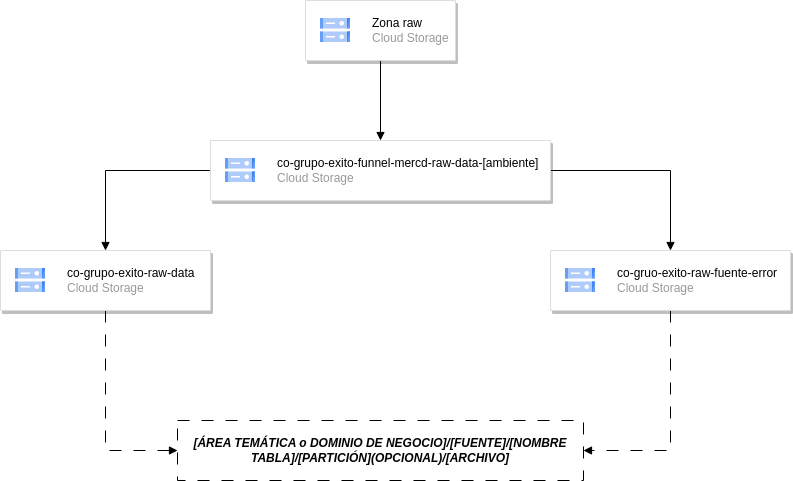

# Documento de Arquitectura de Datos

## Introducción

El auge de las tecnologías en la nube ha cambiado radicalmente la forma en que las organizaciones manejan sus datos.
Google Cloud Platform (GCP) emerge como una solución líder, ofreciendo una gama de servicios innovadores que
proporcionan la agilidad, escalabilidad y seguridad que las empresas modernas requieren.

Este documento describe la arquitectura de datos propuesta para EL proyecto Funnel de Mercadeo, destacando
la importancia de una infraestructura bien planificada que pueda respaldar tanto la operación inmediata como la visión
a largo plazo de la organización.

## Visión general

La arquitectura de datos desempeña un papel fundamental en la gestión eficiente de la información dentro de una empresa.
Se refiere al conjunto de estructuras y procesos que permiten capturar, procesar, almacenar, modelar, publicar y
aprovechar los datos de manera efectiva. Aborda aspectos esenciales como el flujo de datos, el control de la
información, el acceso, las relaciones y su posterior procesamiento y utilización.

La presente arquitectura de datos es fundamental para la gestión eficaz de la información empresarial, abarcando la
captura, procesamiento, almacenamiento y explotación de los datos. En el proyecto actual, se busca construir un Data
Lakehouse en Google Cloud Platform, consolidando datos desde fuentes diversificadas para su almacenamiento centralizado.
Este documento actúa como una hoja de ruta detallada, proporcionando un marco para el diseño sistemático y la
implementación siguiendo las mejores prácticas y recomendaciones de expertos. El propósito es asegurar una base robusta
y eficiente para el manejo de datos, potenciando así la inteligencia de negocios y la toma de decisiones informadas.

## Definición de ambientes

Para asegurar un ciclo de vida de desarrollo eficiente, se definen los siguientes ambientes en GCP:

Ambiente de Desarrollo/QA: Un espacio compartido donde los equipos pueden iterar sobre nuevas funcionalidades y realizar
pruebas de calidad. Este ambiente se caracteriza por su dinamismo y capacidad para adaptarse rápidamente a nuevas ideas.

Ambiente de Producción: Diferenciado del entorno de desarrollo/QA, este ambiente es donde las soluciones están
estabilizadas y se exponen a los usuarios finales. Prioriza la seguridad, estabilidad y rendimiento, y es crítico para
las operaciones del día a día del negocio.

Cada ambiente reside en proyectos de GCP separados, con 'dev' y 'QA' compartiendo recursos para optimizar costos y
facilitar la gestión, mientras que 'producción' se mantiene aislado para garantizar la integridad y disponibilidad del
servicio.

## Arquitectura de datos

La arquitectura de datos es un componente esencial en cualquier proyecto que involucre la gestión, procesamiento y
análisis de datos. Define la estructura y la estrategia para administrar los datos de una organización de manera
eficiente y efectiva. En esencia, la arquitectura de datos actúa como el andamiaje que sostiene toda la infraestructura
de datos, desde la adquisición y almacenamiento de información hasta su transformación y presentación para su análisis y
toma de decisiones.

En un mundo cada vez más impulsado por los datos, la arquitectura de datos es crucial para garantizar la confiabilidad,
la seguridad y la disponibilidad de la información. Además, proporciona la flexibilidad necesaria para adaptarse a las
cambiantes demandas del negocio y las tecnologías emergentes. A continuación, nos adentraremos en las etapas
fundamentales para la definición de la arquitectura de datos.

### Drivers de arquitectura

Los *drivers* en una arquitectura de datos son factores críticos que influyen en el diseño y las decisiones relacionadas
con la gestión de datos en un proyecto. Estos *drivers* representan necesidades y metas clave que deben ser consideradas
para asegurar que la arquitectura de datos cumpla con los requisitos del proyecto y las expectativas de los usuarios.

#### Atributos de calidad

**Consistencia**

Se refiere a la uniformidad y coherencia en la forma en que se almacenan, gestionan y acceden a los datos en toda la
aplicación o sistema. Implica que los datos deben seguir reglas y estándares predefinidos para garantizar que sean
precisos y confiables en todo momento.

| Escenario                              | Given                                                     | When                                                   | Then                                                                                                                                                                                  |
|----------------------------------------|-----------------------------------------------------------|--------------------------------------------------------|---------------------------------------------------------------------------------------------------------------------------------------------------------------------------------------|
| Consistencia en el formato de datos    | Dado que los datos se ingresan en el Data Lake            | Cuando varias fuentes contribuyen con datos            | Entonces asegurarse de que los formatos de datos (por ejemplo, CSV, JSON, Apache Parquet, Delta) sean consistentes y validar que todos los campos de fecha sigan el estándar definido |                                                           |                                                        |                                                                                                                                                                  |
| Consistencia en la validación de datos | Dado que se aplican procesos de transformación de datos   | Cuando los datos se transforman y limpian              | Entonces verificar que todos los datos cumplan con las reglas de validación definidas y asegurarse de la consistencia en el manejo de valores nulos en los conjuntos de datos         |
| Consistencia en metadatos              | Dado que se definen metadatos para los conjuntos de datos | Cuando se realizan cambios en las estructuras de datos | Entonces actualizar automáticamente los metadatos para reflejar los cambios de esquema y asegurarse de que toda la documentación de datos permanezca consistente                      |

**Flexibilidad**

Se refiere a la capacidad del sistema para adaptarse a cambios en los requisitos sin una reescritura completa. Una
arquitectura flexible permite la incorporación de nuevas fuentes de datos, la modificación de estructuras de datos y la
expansión de capacidades sin interrupciones importantes.

| Escenario                   | Given                                                  | When                                               | Then                                                                                                                                                             |
|-----------------------------|--------------------------------------------------------|----------------------------------------------------|------------------------------------------------------------------------------------------------------------------------------------------------------------------|
| Evolución del esquema       | Dado la necesidad de acomodar nuevas fuentes de datos  | Cuando se requieran cambios en el esquema de datos | Entonces asegurarse de que la arquitectura de datos admita la evolución del esquema y que los procesos existentes puedan adaptarse a nuevas estructuras de datos |
| Ingestión dinámica de datos | Dado el requisito de ingresar datos en varios formatos | Cuando se introduzcan nuevas fuentes de datos      | Entonces crear un mecanismo para la ingestión dinámica de datos y permitir la transformación y detección de esquemas sobre la marcha                             |
| Consultas ágiles            | Dado la necesidad de consultas de datos ágiles         | Cuando surjan nuevas preguntas de negocios         | Entonces habilitar consultas ad-hoc en el Data Lake y proporcionar un entorno que permita consultas ágiles sobre los datos                                       |

**Escalabilidad**

La escalabilidad se relaciona con la capacidad del sistema para manejar un aumento en la carga de datos y usuarios sin
perder rendimiento. Una arquitectura escalable permite el crecimiento gradual y eficiente de la infraestructura y los
recursos de datos a medida que la demanda aumenta.

| Escenario                       | Given                                                       | When                                                                 | Then                                                                                                                                                                                        |
|---------------------------------|-------------------------------------------------------------|----------------------------------------------------------------------|---------------------------------------------------------------------------------------------------------------------------------------------------------------------------------------------|
| Aumento de la carga de datos    | Dado que la carga de datos aumenta con el tiempo            | Cuando se incrementa significativamente la demanda de almacenamiento | Entonces asegurarse de que la arquitectura de datos pueda manejar este aumento de carga y escalar horizontalmente los recursos de almacenamiento de manera eficiente                        |
| Aumento de usuarios             | Dado el crecimiento de usuarios y demanda de acceso a datos | Cuando la cantidad de usuarios finales aumenta                       | Entonces garantizar que el sistema mantenga un rendimiento óptimo y permitir la expansión gradual de recursos de procesamiento según sea necesario                                          |
| Incorporación de nuevas fuentes | Dado que se agregan constantemente nuevas fuentes de datos  | Cuando se incorporan nuevas fuentes de datos en el Data Lake         | Entonces habilitar la capacidad de escalar para admitir la adición de fuentes de datos sin interrupciones y asegurar que la infraestructura sea adaptable al crecimiento de datos y fuentes |

**Costo eficiencia**

La costo eficiencia se refiere a la gestión prudente de los recursos y la infraestructura de datos para minimizar los
gastos operativos y de mantenimiento. Una arquitectura de datos eficiente busca optimizar el uso de recursos y reducir
los costos operativos, al tiempo que cumple con los objetivos del proyecto.

| Escenario                  | Given                                                   | When                                                           | Then                                                                                                                                                                       |
|----------------------------|---------------------------------------------------------|----------------------------------------------------------------|----------------------------------------------------------------------------------------------------------------------------------------------------------------------------|
| Optimización de recursos   | Dado el objetivo de reducir los costos operativos       | Cuando se implementan estrategias de optimización de recursos  | Entonces garantizar el uso eficiente de los recursos de almacenamiento y procesamiento y minimizar el gasto operativo en infraestructura y servicios de nube               |
| Uso de recursos reservados | Dado el enfoque en la reducción de costos               | Cuando se utilizan instancias reservadas para recursos de nube | Entonces aprovechar al máximo los descuentos por compromisos a largo plazo y gestionar los recursos de manera que se reduzcan los costos operativos                        |
| Monitorización de costos   | Dado el objetivo de controlar los costos en tiempo real | Cuando se implementa una solución de monitorización de costos  | Entonces permitir una visibilidad completa de los gastos de infraestructura y servicios y tomar decisiones informadas para optimizar el uso de recursos y minimizar costos |

**Mantenibilidad**

La mantenibilidad se centra en la facilidad con la que el sistema puede ser mantenido y mejorado a lo largo del tiempo.
Una arquitectura de datos que promueva la mantenibilidad facilitará la detección y corrección de problemas, así como la
incorporación de actualizaciones y mejoras sin interrupciones significativas.

| Escenario                          | Given                                                      | When                                                         | Then                                                                                                                                                                                      |
|------------------------------------|------------------------------------------------------------|--------------------------------------------------------------|-------------------------------------------------------------------------------------------------------------------------------------------------------------------------------------------|
| Detección de Problemas             | Dado que se necesita una fácil identificación de problemas | Cuando surgen problemas en el sistema de datos               | Entonces proporcionar herramientas de monitoreo y alertas y permitir una rápida detección y diagnóstico de problemas para una solución oportuna                                           |
| Actualizaciones sin interrupciones | Dado el requisito de incorporar actualizaciones y mejoras  | Cuando se lanzan actualizaciones en la arquitectura de datos | Entonces garantizar que las actualizaciones se puedan aplicar sin interrupciones significativas y permitir una transición fluida a nuevas versiones o características                     |
| Gestión de configuración           | Dado que se necesitan cambios en la configuración          | Cuando se realizan cambios en la configuración del sistema   | Entonces implementar una gestión de configuración que sea transparente y rastreable y asegurarse de que los cambios de configuración se documenten adecuadamente para futuras referencias |

**Disponibilidad**

Consiste en asegurar que los sistemas y datos estén disponibles y accesibles en todo momento, evitando interrupciones no
planificadas. Esto se logra mediante redundancia, tolerancia a fallos y estrategias de recuperación para garantizar la
continuidad del servicio incluso en situaciones adversas.

| Escenario                   | Given                                                      | When                                                              | Then                                                                                                                                                                                     |
|-----------------------------|------------------------------------------------------------|-------------------------------------------------------------------|------------------------------------------------------------------------------------------------------------------------------------------------------------------------------------------|
| Tolerancia a fallos         | Dado la necesidad de garantizar la disponibilidad continua | Cuando se producen fallos en componentes del sistema              | Entonces implementar mecanismos de tolerancia a fallos para evitar interrupciones no planificadas y asegurar que los usuarios puedan acceder a los datos incluso en situaciones adversas |
| Redundancia de recursos     | Dado el objetivo de alta disponibilidad                    | Cuando se configuran recursos críticos                            | Entonces establecer redundancia en componentes clave del sistema y garantizar que existan respaldos y alternativas para mantener la continuidad del servicio                             |
| Recuperación ante desastres | Dado que se debe planificar la recuperación ante desastres | Cuando ocurren eventos imprevistos que afectan la infraestructura | Entonces implementar estrategias de recuperación ante desastres para restaurar la operación normal y garantizar que los datos se respalden y puedan recuperarse en caso de pérdida       |

**Seguridad**

Se refiere a la protección de la confidencialidad, integridad y disponibilidad de los datos. Implica la implementación
de medidas de seguridad, como autenticación, autorización, cifrado y auditoría, para proteger los datos contra amenazas
internas y externas.

| Escenario                | Given                                                            | When                                             | Then                                                                                                                                                                |
|--------------------------|------------------------------------------------------------------|--------------------------------------------------|---------------------------------------------------------------------------------------------------------------------------------------------------------------------|
| Acceso autorizado        | Dado la necesidad de proteger la confidencialidad de los datos   | Cuando los usuarios intentan acceder a los datos | Entonces garantizar que el acceso esté autorizado y basado en roles y auditar el acceso para detectar actividades no autorizadas                                    |
| Cifrado de datos         | Dado el requisito de proteger la integridad de los datos         | Cuando los datos se transmiten o almacenan       | Entonces aplicar cifrado de datos para protegerlos contra posibles amenazas y asegurarse de que los datos sensibles estén protegidos de manera efectiva             |
| Auditoría y cumplimiento | Dado que se deben cumplir regulaciones de seguridad y privacidad | Cuando se almacenan datos críticos               | Entonces implementar auditorías de seguridad para rastrear y registrar actividades y garantizar el cumplimiento de normativas y estándares de seguridad pertinentes |

#### Consideraciones

1. **Escalabilidad en GCP**: Aprovechar la escalabilidad de GCP para manejar el aumento de datos y usuarios.
2. **Seguridad en la nube**: Implementar autenticación y autorización en GCP para proteger los datos y cumplir con las
   normativas.
3. **Costos de GCP**: Usar servicios eficientes en costos como BigQuery y Dataflow, y aplicar estrategias de gestión de
   costos.
4. **Latencia**: Optimizar la latencia en GCP para mejorar el rendimiento de consultas y análisis de datos.

#### Restricciones

1. **Presupuesto**: Ajustarse a un presupuesto definido para el proyecto en GCP.
2. **Cumplimiento normativo**: Asegurar el cumplimiento de las regulaciones de seguridad y privacidad de datos
   aplicables.
3. **Recursos limitados**: Operar dentro de los límites de los recursos disponibles en GCP.

#### Métricas

1. **Tiempo de acceso a datos**: Monitorear el tiempo de acceso a datos en el Data Lake de GCP.
2. **Latencia de consultas**: Medir la latencia de las consultas en GCP para mantener respuestas rápidas.
3. **Uso de recursos**: Controlar el uso de recursos en GCP, incluyendo CPU y almacenamiento.
4. **Seguridad y cumplimiento**: Asegurar la conformidad con las políticas de seguridad y normativas de cumplimiento.

#### Requerimientos

1. **Escalabilidad horizontal**: La arquitectura debe permitir escalar horizontalmente en GCP.
2. **Seguridad de datos**: Cifrar datos en reposo y en tránsito y fortalecer la seguridad en GCP.
3. **Disponibilidad continua**: Mantener servicios y datos siempre disponibles.
4. **Automatización**: Automatizar el aprovisionamiento de recursos y la ejecución de flujos de trabajo en GCP.
5. **Respaldo y recuperación**: Establecer políticas de respaldo y recuperación en GCP.
6. **Rendimiento**: Optimizar el rendimiento para análisis rápidos en GCP.
7. **Documentación y metadatos**: Mantener documentación completa de la estructura de datos en GCP.
8. **Flexibilidad**: Permitir cambios y expansión de capacidades en la arquitectura sin interrupciones.
9. **Interfaz gráfica intuitiva**: Proporcionar interfaces fáciles de usar para análisis y toma de decisiones.

### C4 Model

La arquitectura de datos seleccionada para este proyecto en GCP, alineada con los drivers establecidos, es un Data
Lakehouse. Esta arquitectura incorpora la eficiencia de los servicios de GCP para manejar datos de múltiples fuentes y
formatos. Esta arquitectura fusiona los beneficios de los Data Lake y Data Warehouse, facilitando tanto el
almacenamiento centralizado como el procesamiento analítico avanzado de los datos.

El flujo de datos comienza con la ingesta desde fuentes variadas a Cloud Storage, que actúa como la capa "raw" del Data
Lakehouse, manteniendo los datos en su estado original. Dataproc, con sus capacidades de procesamiento en tiempo real y
por lotes, transforma y enriquece estos datos siguiendo las reglas de negocio establecidas, trasladándolos a la capa "
trusted" dentro de Cloud Storage, donde están listos para su posterior agregación.

Las capas de presentación y análisis se construyen sobre BigQuery, que permite realizar consultas complejas y almacenar
datos procesados de forma eficiente. Para el consumo de datos y la generación de insights, se utilizan interfaces como
BigQuery SQL y herramientas de visualización de datos como Looker y Power BI, ofreciendo al equipo administrativo una
plataforma robusta para la toma de decisiones basada en datos.

Para garantizar la trazabilidad y el cumplimiento normativo, se integra Cloud Logging, que ofrece un registro detallado
de todas las operaciones y movimientos de datos. La seguridad y la gestión de identidades se manejan a través de Cloud
IAM, asegurando que solo los usuarios autorizados tengan acceso a los recursos adecuados.

A continuación, se esquematiza y detalla la arquitectura de datos implementada para el proyecto Funnel de Mercadeo.

#### Diagrama de contexto del sistema

#### Diagrama de contenedores

**Descripción**

| Nombre del Contenedor | Descripción del Componente                                    | Responsabilidad                                                                    | Recurso           | Descripción del Recurso                                                                                                                                                                                                           |
|-----------------------|---------------------------------------------------------------|------------------------------------------------------------------------------------|-------------------|-----------------------------------------------------------------------------------------------------------------------------------------------------------------------------------------------------------------------------------|
| Fuente de Datos       | Todas las fuentes de datos asociadas al proyecto.             | Proveer los datos en su estado más crudo.                                          | Cloud Storage     | Servicio de almacenamiento en la nube de Google que permite guardar cualquier cantidad de datos y recuperarlos en cualquier momento y lugar.                                                                                      |
| Orquestación          | Manejo de la ejecución programada de ETLs.                    | Coordinar y programar la ejecución de flujos de trabajo de datos.                  | Cloud Scheduler   | Servicio de Google Cloud que permite programar trabajos recurrentes como llamadas HTTP/S o invocaciones de Pub/Sub.                                                                                                               |
| Procesamiento         | Transformación y carga de datos por lotes.                    | Aplicar la lógica de negocios y preparar los datos para almacenamiento y análisis. | Dataproc/BigQuery | Servicio de procesamiento de datos de GCP que permite desarrollar y ejecutar una amplia gama de procesos de datos en paralelo y a gran escala.                                                                                    |
| Almacenamiento        | Almacenamiento de datos estructurados y procesados.           | Mantener los datos limpios, procesados y listos para el análisis.                  | BigQuery          | Almacén de datos de Google para análisis de grandes conjuntos de datos.                                                                                                                                                           |
| Motor de Consumo      | Consumo de los datos procesados para aplicaciones y usuarios. | Proveer una interfaz para la consulta y análisis de datos.                         | BigQuery          | Plataforma como servicio que ofrece un potente motor de análisis de datos SQL y almacenamiento de datos.                                                                                                                          |
| Analítica de Negocio  | Herramientas para visualización y análisis de datos.          | Generar informes y dashboards para decisiones basadas en datos.                    | Looker/Power BI   | Looker es una plataforma de análisis de negocio de GCP para visualizar y explorar datos. Power BI es una solución de análisis de negocios de Microsoft que permite visualizar datos y compartir insights en toda la organización. |
| Trazabilidad          | Registro de actividades y movimientos de datos.               | Ofrecer seguimiento detallado de las operaciones para auditorías y cumplimiento.   | Cloud Logging     | Servicio de registro de GCP que almacena y gestiona logs de aplicaciones y servicios en la nube.                                                                                                                                  |

#### Diagrama de componentes

**Descripción**

| Componente            | Descripción                                       | Flujo de Datos                                                        |
|-----------------------|---------------------------------------------------|-----------------------------------------------------------------------|
| Fuente de Datos       | Origen de todos los datos del proyecto.           | Datos crudos son extraídos y movidos al procesamiento.                |
| Ingesta               | Admisión de datos por lotes en el sistema.        | Datos ingresados pasan a la validación y extracción raw.              |
| Procesamiento Raw     | Primer nivel de procesamiento de datos crudos.    | Datos validados son transformados a un formato preliminar.            |
| Procesamiento Trusted | Procesamiento secundario para datos de confianza. | Datos transformados en raw se refinan y almacenan en la capa trusted. |
| Motor de Consumo      | Interfaz para acceder a los datos procesados.     | Consultas de datos se realizan para análisis y visualización.         |
| Analítica de Negocio  | Herramientas de BI para interpretar datos.        | Datos consumidos se utilizan para informes y dashboards.              |
| Trazabilidad          | Registro de la actividad y cambios de datos.      | Todas las acciones y modificaciones son registradas para auditorías.  |

#### Diagrama de despliegue

**Descripción**

| Componente                  | Funcionalidad                                     | Ubicación en GCP                   | Conectividad                                          | Consumidores                           |
|-----------------------------|---------------------------------------------------|------------------------------------|-------------------------------------------------------|----------------------------------------|
| Infraestructura como Código | Automatización del despliegue de infraestructura. | Azure DevOps (integración externa) | Interactúa con GCP para desplegar recursos.           | Operaciones/DevOps                     |
| Fuente de Datos             | Almacenamiento de datos iniciales.                | Cloud Storage                      | Fuente para procesos ETL.                             | DataProc, Dataflow                     |
| Ingesta                     | Ingreso de datos en el sistema.                   | Dataflow, BigQuery (manual)        | Recibe datos de fuentes externas.                     | Data Lakehouse                         |
| Orquestación                | Programación de ETLs y flujos de trabajo.         | Cloud Scheduler                    | Ejecuta trabajos programados.                         | Procesamiento, Trazabilidad            |
| Procesamiento               | Transformación de datos (ETL).                    | Dataproc, BigQuery                 | Procesa datos para almacenamiento y análisis.         | Data Lakehouse, Área de Presentación   |
| Almacenamiento              | Repositorio de datos procesados.                  | Cloud Storage, BigQuery            | Almacena los datos procesados.                        | Motor de Consumo, Analítica de Negocio |
| Motor de Consumo            | Acceso y consulta de datos.                       | BigQuery                           | Servicio principal para el consumo de datos.          | Usuarios finales, Analítica de Negocio |
| Analítica de Negocio        | Herramientas de visualización y reporte.          | Power BI, Looker                   | Visualiza y analiza datos para la toma de decisiones. | Equipo Administrativo                  |
| Trazabilidad                | Seguimiento de operaciones y datos.               | Cloud Logging                      | Registra y almacena logs de operaciones.              | Auditoría, Compliance                  |

### Beneficios de la arquitectura

Los beneficios de la arquitectura de Data Lakehouse en GCP incluyen:

- **Almacenamiento versátil**: Capacidad para manejar datos estructurados y no estructurados, adaptándose a diferentes
  esquemas.
- **Escalabilidad eficaz**: Aumento de capacidad de almacenamiento y procesamiento sin sacrificar el rendimiento.
- **Acceso universal**: Datos accesibles para una amplia gama de herramientas y servicios, facilitando el análisis
  colaborativo.
- **Integridad de datos**: Transacciones ACID y un manejo de metadatos robusto garantizan datos consistentes y
  confiables.
- **Análisis profundos**: BigQuery facilita el análisis descriptivo y predictivo, potenciando la inteligencia
  empresarial.
- **Control de costos**: La infraestructura basada en la nube permite un modelo de pago por uso, optimizando la
  inversión en recursos tecnológicos.
- **Ejecución programada de los ETL:** La utilización de workflows de GCP y Cloud Scheduler permite la ejecución
  programada de los ETL, lo que permite una gestión más eficiente de los procesos de integración de datos.

### Consideraciones de implementación

1. Uso de **GCP** como plataforma principal para la implementación de la solución de datos.
2. **Google Cloud Storage** para almacenar las capas raw y trusted, con la capa raw en formato Apache Parquet para
   eficiencia en operaciones de lectura y la capa trusted en formato Delta Lake para operaciones upsert y merge.
3. **BigQuery** para procesamiento de datos (ETLs) y como motor de almacenamiento del área de presentación, aprovechando
   su capacidad de manejo de grandes volúmenes de datos y análisis avanzados.
4. **Dataproc Compute Engine** seleccionado para tareas de procesamiento específicas por su capacidad de predecir la
   necesidad de recursos.
5. Implementación de **procedimientos de validación de datos** para garantizar la calidad antes de la carga en BigQuery.
6. **Compresión y almacenamiento optimizado** en BigQuery para datos de la capa trusted, mejorando el rendimiento y los
   costos.
7. Uso de **Cloud Scheduler** para la orquestación y automatización de flujos de trabajo.
8. Adopción de **Cloud Logging y Cloud Monitoring** para el seguimiento y monitoreo del rendimiento de la aplicación y
   la infraestructura.
9. Gestión de acceso y autorización a través de **IAM**, asegurando un control eficiente y seguro sobre los datos.
10. **Seguridad en GCP** reforzada con encriptación de extremo a extremo, protección de red y autenticación robusta.

### Nomenclatura de servicios

#### Proyectos

El identificador de un proyecto debe ser único. Se define seguir una convención de nomenclatura estándar para el
nombramiento de proyectos en GCP. De acuerdo a la estructura definida se sugiere organizar los recursos dependiendo de
su entorno como desarrollo/qa (dev) y producción (pdn).

La nomenclatura definida para los proyectos en GCP es:

`[país]-[empresa]-[unegocio][solución/servicio/app]-[ambiente]`

| Componente                | Descripción                                                       |
|---------------------------|-------------------------------------------------------------------|
| `[ambiente]`              | Nombre del ambiente (dev o pdn)                                   |
| `[país]`                  | Usar máximo dos caracteres en minúscula. Ejemplo: co, pe, ch, me. |
| `[empresa]`               | Nombre corto de la empresa.                                       |
| `[unidad de negocio]`     | Nombre corto de la unidad de negocio                              |
| `[solución/servicio/app]` | Nombre que resuma la solución a implementar.                      |

A continuación se muestran ejemplos de nombramientos de proyectos:

- co-grupoexito-funnel-mercd-dev
- co-grupoexito-funnel-mercd-pdn

#### Recursos

A nivel básico, los recursos representan los componentes esenciales que constituyen la base de todos los servicios
dentro de GCP. Estos recursos incluyen elementos como buckets de Cloud Storage, clusters de Dataproc, entre otros.

Para facilitar la gestión y la identificación de estos recursos, se sugiere la siguiente nomenclatura (excepto para los
sistemas de almacenamiento):

`[tipo de recurso]-[solución]-[correlativo](opcional)-[ambiente]`

Para los sistemas de almacenamiento se sugiere la siguiente estructura para los bucket:

`[país]-[empresa]-[solución]-[tipoalmacenamiento]-data-[ambiente]`

###### Procesamiento

A continuación, se presentan recomendaciones de cómo aplicar esta nomenclatura sugerida a los recursos de procesamiento.
Esta convención de nomenclatura contribuye a una organización clara y efectiva de los recursos, permitiendo una
administración más eficiente de los servicios y activos en la plataforma.

| Recurso                   | Nomenclatura                               |
|---------------------------|--------------------------------------------|
| Dataproc Workflow         | `dp-funnel-mercd-workflow-[ambiente]`      |
| Dataproc Cluster          | `dp-funnel-mercd-pipeline-[ambiente]`      |
| Dataproc Job              | `dp-funnel-mercd-job-[ambiente]`           |
| BigQuery Stored Procedure | `sp_funnel_mercd_[objetivo sp]_[ambiente]` |
| BigQuery Scheduled Query  | `sq-funnel-mercd-job-[ambiente]`           |
| Cloud Scheduler Job       | `cs-funnel-mercd-scheduler-[ambiente]`     |

###### Almacenamiento

En cuanto al almacenamiento se establecerán las capas de almacenamiento RAW, TRUSTED y REFINED.

**Capa RAW**

La capa RAW es una capa de aterrizaje de los datos, en esta capa llegan los datos provenientes de diferentes orígenes en
su formato original, ya sea a través de procesos batch o streaming.

Los datos arribarán al siguiente bucket **`co-grupo-exito-funnel-mercd-raw-data-[ambiente]`** respetando la siguiente
estructura:

`[país]_[empresa]_raw_data/[FUENTE]/[ÁREA TEMÁTICA o DOMINIO DE NEGOCIO]/[NOMBRE TABLA]/[PARTICIÓN](OPCIONAL)/[ARCHIVO]`

Si el archivo tuviera errores o hubiera ocurrido un error durante el proceso, el pipeline almacenará el archivo en el
siguiente ruta:

`[país]_[empresa]_raw_fuente_error/[FUENTE]/[ÁREA TEMÁTICA o DOMINIO DE NEGOCIO]/[NOMBRE TABLA]/[PARTICIÓN](OPCIONAL)/[ARCHIVO]`

**Capa TRUSTED**

A diferencia de la capa RAW en donde los datos son parciales, la capa TRUSTED consolida la información de forma
permanente e histórica, con el fin de tener los datos similares a como se encuentran en las fuentes de información, pero
disponibles para las diferentes iniciativas de modelado de datos, business intelligence and business analytics.

Los datos arribarán al bucket **`co-grupo-exito-funnel-mercd-trusted-data-[ambiente]`** y dependiendo de área temática,
fuente de información o dominio se almacenarán en la siguiente ruta:

`[FUENTE]/[ÁREA TEMÁTICA o DOMINIO DE NEGOCIO]/[NOMBRE TABLA]/[PARTICIÓN](OPCIONAL)/[ARCHIVO]`

**Almacenamiento de código**

La capa ASSETS es una capa en donde reposan activos de código como código fuente y archivos de configuración necesarios
para la ejecución de los pipelines de datos.

Los datos arribarán al bucket **`co-grupo-exito-funnel-mercd-app-data-[ambiente]`** y dependiendo del recurso se
dispondrán en el bucket siguiendo la estructura definida.

`[NOMBRE PROYECTO]/[CATEGORIA]/[ARCHIVOS]`

**Capa REFINED**

La capa REFINED es una capa en donde reposan los datos procesados y listos para ser consumidos por los usuarios de
negocio. Esta capa estará alojada en BigQuery.

Para las bases de datos en BigQuery se recomienda usar la siguiente estructura:

`[capa]_[fuente]_[dominio de negocio]`

Para las tablas se recomienda usar la siguiente estructura:

`[tipo](opcional)_[nombre_tabla]`

