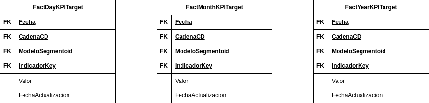

# Diseño e Implementación del Modelo Dimensional

## Introducción

En la era de la información, donde los datos son un activo vital, la capacidad de una organización para comprender y
utilizar eficazmente estos datos es esencial para mantener una ventaja competitiva. El Proyecto Funnel de Mercadeo
representa un salto estratégico hacia una toma de decisiones más informada y basada en datos para Grupo Éxito. Este
proyecto busca implementar una solución de almacén de datos robusta y moderna que centralice los datos críticos de
negocio y los haga accesibles para análisis en profundidad y reportes oportunos.

Con un volumen de datos que abarca desde ventas en línea hasta interacciones con el cliente, el Proyecto Funnel tiene
como objetivo disponibilizar 19 indicadores clave de rendimiento (KPIs) que proporcionarán insights para optimizar las
estrategias de marketing y ventas. Este documento detalla el diseño e implementación de la solución de modelado
dimensional, que se estructura alrededor de un conjunto de tablas de hechos y dimensiones, diseñadas para soportar
consultas analíticas y de reportes en BigQuery y para ser accedidas desde Looker.

## Definiciones

A continuación, se proporciona un glosario de términos clave utilizados en este informe para facilitar una comprensión
clara de los conceptos y procedimientos de modelado dimensional:

- **Almacén de Datos (Data Warehouse):** Una base de datos centralizada diseñada para integrar datos de múltiples
  fuentes para facilitar el análisis y la generación de informes.

- **Análisis Multidimensional:** El proceso de examinar datos a través de múltiples dimensiones (como tiempo, ubicación,
  producto) para obtener insights más profundos.

- **BigQuery:** Un servicio de almacenamiento de datos empresariales en la nube, proporcionado por Google, que permite
  el análisis SQL de grandes conjuntos de datos.

- **Dimensiones (Dimensions):** Estructuras que categorizan y describen los datos en un almacén de datos, como fecha,
  producto o cliente, proporcionando contextos para los hechos.

- **ETL (Extract, Transform, Load):** Un proceso en el que los datos se extraen de diferentes sistemas de origen, se
  transforman a un formato adecuado y luego se cargan en un almacén de datos.

- **Granularidad (Granularity):** El nivel de detalle o resolución de los datos almacenados en un almacén de datos.

- **Hechos (Facts):** Las métricas o medidas cuantificables, como ventas o visitas, que son el foco del análisis en un
  almacén de datos.

- **Indicadores Clave de Rendimiento (KPIs):** Métricas utilizadas para evaluar el éxito de una organización en áreas
  específicas de rendimiento.

- **Looker:** Una plataforma de análisis de datos que permite a los usuarios explorar, analizar y compartir datos de
  negocio.

- **Modelado Dimensional:** Una técnica de diseño de base de datos utilizada en almacenes de datos que estructura los
  datos en tablas de hechos y dimensiones para un análisis eficiente.

- **Sistema DW/BI (Data Warehousing/Business Intelligence):** Un sistema que combina tecnologías de almacenamiento de
  datos y técnicas de inteligencia empresarial para el análisis de datos y la toma de decisiones.

- **Esquema en Estrella (Star Schema):** Un modelo de base de datos para almacenes de datos donde una tabla de hechos
  central se conecta a múltiples tablas de dimensiones.

- **Tablas de Hechos Degeneradas:** Tablas de hechos que no tienen medidas numéricas propias y se utilizan para rastrear
  eventos o transacciones individuales.

## Diseño del Modelo Dimensional

El diseño de nuestro almacén de datos se basa en la metodología de Kimball, un enfoque líder en la industria para la
construcción de soluciones de almacén de datos. La metodología de Kimball pone énfasis en el modelado dimensional para
la presentación de datos, utilizando conceptos como las dimensiones conformadas y los esquemas en estrella para
garantizar que los datos sean intuitivos y accesibles para los usuarios de negocio.

La metodología no solo proporciona un camino hacia un diseño lógico claro y una implementación técnica eficiente sino
que también facilita la escalabilidad y mantenibilidad de la solución de almacén de datos. Nuestro diseño aborda tanto
las necesidades actuales como las futuras expansiones y adaptaciones, manteniendo la integridad y coherencia de los
datos a lo largo del tiempo.

La metodología comprende cuatro etapas principales: Selección de procesos de negocio, especificar granularidad,
identificar dimensiones e identificar hechos. Cada etapa es crítica para asegurar que la solución final cumpla con las
necesidades de análisis y reporte de la organización.

A continuación, profundizaremos en cada una de las cuatro etapas del diseño dimensional. Describiremos cómo
seleccionamos y definimos los procesos de negocio clave para el almacén de datos, especificamos la granularidad adecuada
para las tablas de hechos, identificamos las dimensiones que proporcionan los contextos necesarios para el análisis y
determinamos los hechos que capturan las métricas de rendimiento esenciales. Este enfoque detallado asegura que cada
aspecto del diseño esté alineado con las estrategias de negocio y las necesidades analíticas, resultando en un almacén
de datos que es tanto funcionalmente rico como técnicamente robusto.

### Proceso de negocio

El primer paso en el diseño consiste en decidir qué proceso de negocio modelar, combinando la comprensión de los
requerimientos empresariales con el conocimiento de los datos fuente disponibles.

En el caso de nuestro proyecto, la gerencia desea comprender mejor el rendimiento de las campañas de mercadeo y ventas
mediante la consulta y comparación de indicadores clave de rendimiento (KPIs) con sus respectivas metas. El proceso de
negocio que estamos modelando es la evaluación del rendimiento de campañas de mercadeo y ventas. Estos datos permitirán
a los usuarios de negocio analizar cómo ciertas campañas o iniciativas influyen en las métricas de interés, como la
generación de leads, conversiones y ventas, y cómo se comparan estos resultados con los objetivos establecidos a
diferentes niveles de granularidad (por ejemplo, diario, mensual, por segmento de cliente, por cadena, etc.).

### Grano

Después de identificar el proceso de negocio, nos enfocamos en una de las decisiones más críticas del diseño
dimensional: la granularidad de los datos. La granularidad se refiere al nivel más detallado de información que se
captura en las tablas de hechos de un almacén de datos. Esta elección es fundamental ya que dicta la capacidad del
sistema para soportar análisis detallados y afecta directamente la agilidad con la que los usuarios pueden obtener
insights a partir de los datos.

En nuestro contexto, la granularidad adecuada debe permitir a los usuarios de negocio realizar comparaciones de
indicadores de rendimiento contra metas preestablecidas, con la posibilidad de examinar los datos a través de diversas
dimensiones temporales como son el día, el mes y el año. Esta decisión sigue naturalmente a la selección del proceso de
negocio, ya que la granularidad establecida debe soportar y enriquecer el tipo de análisis que el proceso de negocio
requiere.

Con base en estas consideraciones, hemos establecido una granularidad que refleja cada transacción a nivel diario,
consolidaciones mensuales y resúmenes anuales en nuestras tablas de hechos. Hemos optado por separar estas
granularidades en diferentes tablas de hechos par evitar prácticas que puedan comprometer la integridad del análisis.
Esta estructura permite a los usuarios sumarizar o desglosar los datos sin perder la capacidad de realizar análisis
detallados, manteniendo la integridad y coherencia del modelo dimensional.

Al mantener los datos en su estado más granular, y al mismo tiempo proporcionar niveles de resumen, garantizamos que los
usuarios empresariales tengan acceso a la información precisa que necesitan para un análisis en profundidad y la toma de
decisiones informadas, asegurando al mismo tiempo que el sistema DW/BI sea altamente funcional y receptivo a las
necesidades de análisis del negocio.

### Tablas de Dimensiones

Continuando con nuestro diseño dimensional después de establecer la granularidad de las tablas de hechos, procedemos a
identificar las dimensiones que servirán como ejes de análisis para el proceso de negocio. La elección de dimensiones es
un reflejo directo del grano de la tabla de hechos y de las preguntas de negocio que el sistema DW/BI necesita
responder.

#### DimDate (Fecha)

La dimensión `DimDate` es una de las dimensiones fundamentales en nuestro modelo dimensional, ya que ofrece la capacidad
de realizar análisis temporales precisos y multidimensionales. Esta dimensión, que ya existe en nuestro entorno de
BigQuery, será reutilizada con una serie de atributos que permiten un desglose detallado de la información de tiempo.
Los atributos incluidos son:

- **PK Fecha:** El atributo principal que registra la fecha exacta de cada transacción o evento.

- **FechaAñoAnterior:** Permite comparaciones año a año, facilitando el análisis de tendencias y cambios interanuales.

- **FechaAñoAnteriorDiaSemana:** Ofrece la capacidad de comparar días específicos de la semana en diferentes años, lo
  cual es útil para identificar patrones semanales estacionales.

- **FechaMesAnterior:** Utilizado para realizar comparaciones mes a mes, esencial para el análisis mensual de
  rendimiento.

- **FechaDiaAnterior:** Habilita el análisis diario y la comparación entre diferentes días consecutivos.

- **AñoMesId, AñoId, WeekId, MonthId:** Estos campos identificadores son críticos para agrupar eventos dentro de
  estructuras temporales estándar como años, semanas y meses.

- **SemesterID:** Proporciona una división semestral del año, útil para análisis que requieren una vista de medio año.

- **NumMes y NumSemanaAño:** Números secuenciales para el mes y la semana dentro del año, respectivamente, permitiendo
  un seguimiento y comparación secuencial sin la necesidad de nombres de meses o semanas.

- **NumeroDia:** Un identificador para cada día, útil para análisis operativos y logísticos diarios.

- **DiaDec y MesDec:** Decodificadores para días y meses, posiblemente utilizados para representaciones específicas o
  formatos requeridos en reportes y dashboards.

La inclusión de estos atributos en `DimDate` asegura que los usuarios puedan realizar análisis temporales complejos y
detallados. Además, la integración de la `FechaActualizacion` (aunque no listada aquí, previamente mencionada como
necesaria para la dimensión) garantizará que los usuarios estén al tanto de la última actualización de los datos,
manteniendo así la precisión y relevancia del análisis de tiempo.

La dimensión `DimDate` es un componente crítico del modelo, ya que afecta casi todos los análisis en el almacén de
datos, desde informes operativos hasta insights estratégicos. Por tanto, su diseño y mantenimiento se manejan con la
mayor prioridad.

#### DimCadena (Cadena)

La dimensión `DimCadena` es un componente integral del modelo dimensional que representa las diversas entidades
comerciales bajo el Grupo Éxito. Esta dimensión permite segmentar y analizar los datos de acuerdo con la cadena
específica, lo cual es esencial ya que numerosos indicadores de rendimiento se calculan con esta agrupación. Con los
siguientes atributos, la dimensión se estructura para un análisis efectivo:

- **CadenaCD (Código de Cadena):** Identificador único de cada cadena.
- **CorporacionCD (Código de Corporación):** Vincula cada cadena a su corporación superior.
- **CadenaDesc (Descripción de la Cadena):** Descripción legible de la cadena.
- **FechaActualizacion (Fecha de Actualización):** Registro de la última actualización de la dimensión.

La dimensión existente no tiene el atributo `FechaActualizacion`. Este se integrará en las etapas de ETL y garantizará
que los usuarios estén al tanto de la última actualización de los datos, manteniendo así la precisión y relevancia del
análisis de tiempo.

Dada la naturaleza de nuestro modelo dimensional y la posibilidad de que no todos los KPI se agreguen por cadena, es
vital evitar valores nulos en las claves foráneas de las tablas de hechos. Según las mejores prácticas, los valores
nulos pueden llevar a violaciones de la integridad referencial. Por lo tanto, se debe añadir una fila predeterminada en
la dimensión `DimCadena` que represente las condiciones de "Desconocido" o "No Aplicable". Esta fila tendrá una clave
sustituta única y servirá como referente para cualquier hecho que no se asocie con una cadena específica.

La implementación de una fila predeterminada asegura la integridad de los datos y mantiene la consistencia en el
análisis, permitiendo que las funciones de agregación como SUM, COUNT, MIN, MAX y AVG funcionen correctamente incluso
cuando algunos KPI no se desglosen por cadena. La presencia de esta fila predeterminada es una salvaguarda esencial que
garantiza la robustez y la fiabilidad del almacén de datos al manejar casos en los que la información de la cadena no
está disponible o no es aplicable.

#### DimModeloSegmento (Modelo de Segmento)

La dimensión `DimModeloSegmento` es vital para el análisis segmentado de clientes dentro de nuestro modelo dimensional.
Al clasificar a los clientes en diferentes grupos o segmentos según un modelo de segmentación aplicado a cada cadena,
esta dimensión permite un análisis detallado del comportamiento y preferencias del cliente. Los atributos clave de esta
dimensión incluyen:

- **ModeloSegmentoId:** Es el identificador único para cada segmento dentro del modelo, facilitando la referencia
  precisa a segmentos específicos.

- **ModelId:** Este atributo enlaza con el modelo de segmentación específico de una cadena, permitiendo diferenciar
  entre los segmentos de cada una.

- **ModelSegmentoDesc:** Proporciona una descripción textual del segmento, lo que es crucial para entender el contexto y
  las características que definen cada grupo de clientes.

- **FechaActualizacion:** Registra la última actualización de cualquier información dentro de la dimensión, garantizando
  que los datos de segmentación sean actuales y relevantes.

La dimensión existente no tiene el atributo `FechaActualizacion`. Este se integrará en las etapas de ETL y garantizará
que los usuarios estén al tanto de la última actualización de los datos, manteniendo así la precisión y relevancia del
análisis de tiempo.

Debido a que no todos los indicadores se agrupan por segmentación, es esencial incluir una fila por defecto
en `DimModeloSegmento`. Esta fila representará los casos en los que la segmentación no es aplicable o la información de
segmentación no está disponible, asegurando que la integridad referencial se mantenga y que las operaciones de
agregación no se vean afectadas por la presencia de valores nulos. La fila por defecto permitirá que las funciones de
agregado continúen funcionando adecuadamente y que los usuarios puedan realizar análisis consistentes incluso cuando un
segmento específico no esté definido para un KPI.

La integración y mantenimiento de la dimensión `DimModeloSegmento` juegan un papel crucial en la capacidad de nuestro
modelo para realizar análisis de mercado finamente granulados y adaptados a las necesidades específicas de cada cadena
del Grupo Éxito. La existencia de una fila por defecto dentro de esta dimensión es una práctica recomendada que seguimos
para garantizar la flexibilidad y la robustez del análisis en nuestro almacén de datos.

#### DimKPI (Key Performance Indicator)

La dimensión `DimKPI` actúa como el nexo central en nuestro almacén de datos para el seguimiento y análisis de
indicadores clave de rendimiento (KPIs). Esta dimensión es una adición vital que creamos para manejar eficazmente la
diversidad y la escala de métricas que son cruciales para la inteligencia de negocios. Los atributos de esta dimensión
son:

- **IndicadorKey:** La clave principal que sirve como identificador único para cada KPI, asegurando un acceso preciso y
  rápido a los datos del indicador.

- **Indicador:** El nombre o título del KPI, que proporciona una identificación rápida y comprensible para los usuarios
  finales.

- **Tipo:** Clasifica el KPI en función de su tipo (por ejemplo, porcentaje, ventas acumuladas, etc.).

- **Descripcion:** Detalla el propósito y la naturaleza del KPI, ofreciendo contexto para su interpretación y uso en
  análisis.

- **FechaActualizacion:** Registra cuándo se actualizó por última vez la información del KPI, lo cual es esencial para
  mantener la relevancia y exactitud en el análisis temporal de los indicadores.

La justificación para el diseño de la dimensión `DimKPI` radica en su papel de facilitar referencias consistentes y
centralizadas a los KPIs a través de múltiples tablas de hechos degeneradas. En lugar de duplicar los datos de los
indicadores en cada tabla de hechos, cada hecho puede hacer referencia a un KPI específico mediante la `IndicadorKey`.
Esto simplifica la arquitectura del modelo de datos, reduce la redundancia y mejora la integridad de los datos al
centralizar la definición y el mantenimiento de los KPIs en una única dimensión.

Además, este diseño promueve la escalabilidad y la flexibilidad del modelo. A medida que la empresa crece y se
introducen nuevos KPIs, se pueden agregar fácilmente a `DimKPI` sin la necesidad de reestructurar las tablas de hechos
existentes. Esto hace que el modelo sea ágil y capaz de adaptarse a las cambiantes necesidades de análisis y reportes.

### Tablas de Hechos

En nuestro modelo dimensional, las tablas de hechos son el núcleo donde convergen todas las dimensiones, proporcionando
el contexto necesario para una rica análisis de datos. Estas tablas almacenan las métricas cuantificables y
observaciones de eventos de negocio que son esenciales para el monitoreo, la gestión y la toma de decisiones
estratégicas. Cada registro en una tabla de hechos representa un evento o transacción específica, ligada a múltiples
dimensiones que ofrecen una perspectiva multidimensional.

En nuestro esquema, optamos por utilizar tablas de hechos degeneradas, un diseño que se alinea estrechamente con
prácticas de modelado dimensional eficientes. Las tablas de hechos degeneradas son particularmente útiles cuando la
naturaleza de los datos de negocio no requiere o no posee medidas numéricas descriptivas propias. En cambio, el enfoque
se centra en las claves de dimensiones que actúan como identificadores únicos de los hechos. Este enfoque es
particularmente relevante para nuestro modelo, ya que nos permite:

- Mantener una estructura simplificada y eficiente, minimizando la redundancia de datos.
- Mejorar el rendimiento de las consultas, dado que hay menos atributos numéricos para procesar.
- Facilitar la escalabilidad del modelo, permitiendo la incorporación de nuevos tipos de eventos o transacciones sin la
  necesidad de modificar la estructura existente.

La clave para trabajar con estas tablas de hechos degeneradas es la consistencia y la normalización de los KPIs a través
de la dimensión `DimKPI`. En lugar de almacenar valores redundantes de KPIs en cada tabla de hechos, utilizamos
referencias normalizadas, lo que no solo mejora la integridad de los datos sino que también optimiza las consultas y el
rendimiento de la base de datos. Además, este enfoque promueve una alta escalabilidad del modelo; cuando se introducen
nuevos KPIs, pueden ser incorporados al modelo sin grandes alteraciones en las tablas de hechos existentes, asegurando
que el modelo pueda crecer y adaptarse junto con la empresa.

#### Tablas de Hechos de indicadores calculados

Las tablas de hechos calculados en nuestro modelo dimensional representan eventos y transacciones del negocio
cuantificados a través de indicadores clave de rendimiento (KPIs). Estas tablas son el resultado de procesos de ETL
sofisticados y están diseñadas para satisfacer las necesidades de análisis en diferentes niveles temporales utilizando
una convención de fechas consistente para garantizar la integridad y eficacia del modelo.

**FactDayKPI (KPI Diario)**

`FactDayKPI` almacena los KPIs que se calculan diariamente, proporcionando insights operativos y el seguimiento del
rendimiento de manera detallada. La estructura de esta tabla es como sigue:

- **Fecha:** Utiliza la fecha exacta del evento o transacción.
- **CadenaCD:** Identifica la cadena específica asociada con el KPI.
- **ModeloSegmentoId:** Enlaza el KPI con un segmento de modelo específico dentro de una cadena.
- **IndicadorKey:** La clave única para cada KPI, permitiendo un seguimiento detallado y preciso.
- **Valor:** La métrica numérica calculada para el KPI en el día específico.
- **FechaActualizacion:** Indica cuándo se calculó o se actualizó por última vez el KPI.

**FactMonthKPI (KPI Mensual)**

`FactMonthKPI` resume los KPIs a nivel mensual y se utiliza para la evaluación del rendimiento mensual y la
planificación. Los atributos clave incluyen:

- **Fecha:** Representa el primer día del mes correspondiente al KPI para mantener uniformidad.
- **CadenaCD:** Identifica la cadena a la que pertenece el KPI mensual.
- **ModeloSegmentoId:** Asocia el KPI con un segmento específico del modelo para ese mes.
- **IndicadorKey:** Referencia única a la definición del KPI en `DimKPI`.
- **Valor:** La métrica numérica calculada que refleja el rendimiento mensual.
- **FechaActualizacion:** La fecha en que se actualizó el valor mensual, asegurando datos actuales para el análisis.

**FactYearKPI (KPI Anual)**

`FactYearKPI` captura los KPIs en una escala anual, apoyando la visión estratégica y el análisis de tendencias a largo
plazo. La tabla incluye:

- **Fecha:** Corresponde al primer día del año para el KPI anual.
- **CadenaCD:** Define la cadena a la cual el KPI anual está asociado.
- **ModeloSegmentoId:** Vincula el KPI con un segmento del modelo para el año completo.
- **IndicadorKey:** La clave única que identifica el KPI dentro de `DimKPI`.
- **Valor:** La medida de rendimiento acumulada a lo largo del año.
- **FechaActualizacion:** Proporciona la última fecha en la que el KPI anual fue calculado o modificado.

Cada una de estas tablas de hechos calculados está diseñada no solo para integrar datos de rendimiento, sino también
para servir como una base sólida y coherente para el análisis en toda la organización. La selección cuidadosa del grano
y la estructura de las claves de fecha garantiza que la información sea intuitiva y accesible para los usuarios finales,
proporcionando un marco confiable para el análisis estratégico y la toma de decisiones basada en datos.

#### Tablas de Hechos de Metas

Las tablas de hechos de metas constituyen un aspecto esencial de nuestro modelo dimensional, ya que encapsulan los
objetivos y aspiraciones establecidos por los usuarios de negocio. Estas metas no son calculadas automáticamente
mediante procesos de ETL, sino que son definidas y proporcionadas directamente por los equipos de negocio para reflejar
las expectativas y los objetivos estratégicos de la empresa. El propósito de estas tablas es permitir una comparación
directa entre el rendimiento real y las metas establecidas, facilitando así una evaluación precisa del progreso y la
efectividad de las estrategias empresariales.

**FactDayKPI Target (Meta de KPI Diario)**

`FactDayKPI Target` almacena las metas diarias para los KPIs, proporcionando un punto de referencia detallado para la
comparación día a día. Los atributos de esta tabla son:

- **Fecha:** La fecha específica a la cual se aplica la meta del KPI.
- **CadenaCD:** La cadena específica para la cual se ha establecido la meta.
- **ModeloSegmentoId:** El segmento del modelo de negocio al cual la meta está orientada.
- **IndicadorKey:** La clave única que enlaza la meta con un KPI específico en `DimKPI`.
- **Valor:** La cifra objetivo establecida para el KPI en la fecha dada.
- **FechaActualizacion:** La fecha en la que se estableció o modificó por última vez la meta del KPI.

**FactMonthKPI Target (Meta de KPI Mensual)**

`FactMonthKPI Target` refleja las metas mensuales y es crucial para el seguimiento del progreso hacia los objetivos a
medio plazo. Incluye:

- **Fecha:** Representa el primer día del mes de la meta, proporcionando un estándar para el análisis mensual.
- **CadenaCD:** Identifica la cadena dentro de la cual se ha fijado la meta mensual.
- **ModeloSegmentoId:** Asocia la meta con un segmento específico del modelo para ese mes.
- **IndicadorKey:** Conecta la meta con la definición del KPI correspondiente.
- **Valor:** La meta numérica establecida para el mes.
- **FechaActualizacion:** Indica la última actualización de la meta mensual.

**FactYearKPI Target (Meta de KPI Anual)**

`FactYearKPI Target` agrupa las metas anuales, apoyando la dirección estratégica y la planificación a largo plazo.
Contiene:

- **Fecha:** Corresponde al primer día del año para la meta anual.
- **CadenaCD:** Define la cadena a la que está asociada la meta anual.
- **ModeloSegmentoId:** Vincula la meta con el segmento del modelo anual.
- **IndicadorKey:** Identifica el KPI dentro de `DimKPI` para el cual se ha establecido la meta.
- **Valor:** La cifra objetivo anual.
- **FechaActualizacion:** La fecha en que se actualizó o estableció por última vez la meta anual.

Las tablas de hechos de metas son una herramienta clave para el alineamiento organizacional y la responsabilidad, ya que
permiten a los equipos de negocio y a los analistas medir el rendimiento real en contraste con los objetivos
establecidos. La existencia de estas tablas garantiza que los esfuerzos y recursos estén dirigidos hacia las prioridades
estratégicas y que las decisiones basadas en datos sean fundamentadas y orientadas hacia el logro de metas concretas.

## Implementación del Modelo Dimensional

La implementación del modelo dimensional en BigQuery está diseñada para proporcionar una plataforma de análisis y
reportes robusta, que refleje fielmente las métricas de rendimiento del Grupo Éxito. Cada componente del modelo ha sido
cuidadosamente integrado para garantizar la precisión, la eficiencia y la relevancia de los datos.

La estructura de nuestro modelo se compone de tablas de hechos y dimensiones interconectadas, formando un esquema en
estrella que facilita el análisis multidimensional. Las dimensiones como `DimDate`, `DimCadena`, y `DimModeloSegmento`
proporcionan los ejes analíticos que enriquecen los hechos con contexto descriptivo. Las tablas de hechos,
incluyendo `FactDayKPI`, `FactMonthKPI`, `FactYearKPI`, `FactDayKPITarget`, `FactMonthKPITarget`, y `FactYearKPITarget`,
contienen las métricas numéricas y las metas que reflejan el rendimiento y las aspiraciones del negocio.

Cada tabla de hechos se asocia con dimensiones específicas utilizando claves foráneas que apuntan a la clave primaria
correspondiente en las tablas de dimensiones. Por ejemplo, la clave foránea `Fecha` en `FactDayKPI` se vincula
directamente con `DimDate`, permitiendo una referencia directa a cualquier punto en el tiempo. Este enfoque normalizado
garantiza que los datos sean consistentes, confiables y fáciles de interpretar.

La implementación también considera la granularidad de los datos. Mientras `FactDayKPI` utiliza la fecha exacta para
cada evento, `FactMonthKPI` y `FactYearKPI` utilizan el primer día del mes y del año respectivamente para consolidar la
información, lo que permite comparaciones consistentes y significativas en diferentes niveles temporales.

El modelo ha sido diseñado con vistas a la escalabilidad, permitiendo la incorporación de nuevas dimensiones y hechos
sin perturbar la arquitectura existente. Esto es vital para adaptarse a las cambiantes necesidades del negocio y para
incorporar nuevos flujos de datos según surjan.

La implementación se completa con la inclusión de las tablas de metas, que están directamente influenciadas por los
inputs de los usuarios de negocio. Estas tablas permiten una comparación directa entre los KPIs calculados y las metas,
ofreciendo una imagen clara de la posición actual del negocio en relación con sus objetivos.

Nuestro modelo dimensional en BigQuery está listo para servir como la piedra angular de la inteligencia
empresarial para el Grupo Éxito, proporcionando una base potente y flexible para impulsar la toma de decisiones
basada en datos.

## Recomendaciones

Para la implementación exitosa del modelo dimensional, recomendamos lo siguiente:

1. **Validación de Datos:** Asegurar la calidad y la integridad de los datos mediante la validación continua y la
   implementación de controles de integridad referencial.

2. **Capacitación de Usuarios:** Facilitar sesiones de capacitación para los usuarios de negocio con el fin de maximizar
   la utilidad del almacén de datos y promover la adopción de la herramienta.

3. **Monitoreo del Rendimiento:** Implementar monitoreo y ajuste del rendimiento para garantizar que las consultas se
   ejecuten de manera eficiente a medida que el volumen de datos crece.

4. **Seguridad de los Datos:** Establecer políticas de seguridad y acceso para proteger los datos y cumplir con los
   estándares de privacidad y regulaciones.

5. **Mantenimiento del Modelo:** Planificar revisiones periódicas del modelo para asegurar que continúe alineado con las
   estrategias de negocio y las necesidades analíticas.

6. **Iteración y Mejora Continua:** Adoptar un enfoque iterativo y estar abierto a la mejora continua del modelo a
   medida que se reciban comentarios de los usuarios y cambien las necesidades del negocio.
